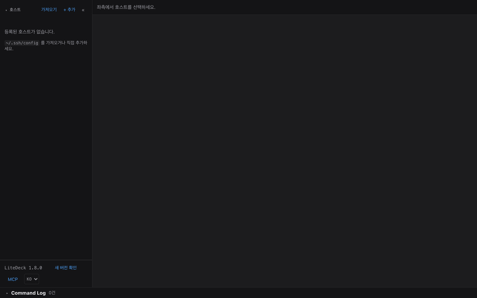
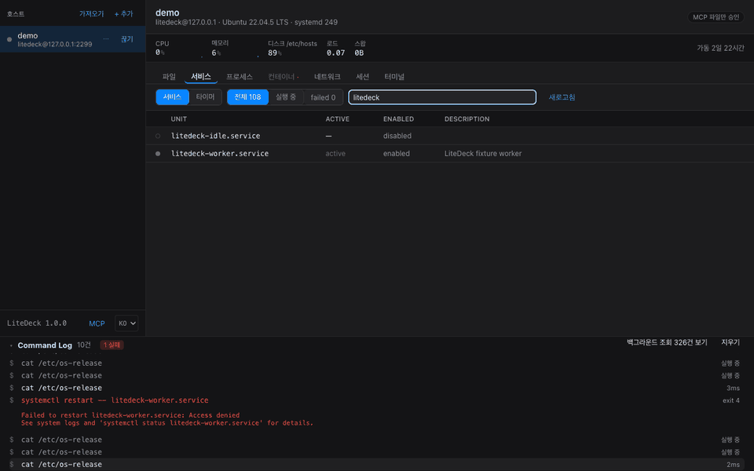

<p align="center">
  <picture>
    <source media="(prefers-color-scheme: dark)" srcset="docs/logo-dark.png">
    
  </picture>
</p>

<h1 align="center">LiteDeck</h1>

<p align="center">
  <b>Manage a remote server from a local native GUI over SSH alone, with nothing installed on the server.</b>
</p>

<p align="center">
  <a href="https://github.com/cpprhtn/LiteDeck/actions/workflows/ci.yml"></a>
  <a href="https://github.com/cpprhtn/LiteDeck/releases"></a>
  <a href="LICENSE"></a>
  
</p>

<p align="center">
  <a href="README.md">한국어</a> · <b>English</b>
</p>

<p align="center">
  <a href="#install">Download</a> ·
  <a href="#features">Features</a> ·
  <a href="docs/security.en.md">Security</a> ·
  <a href="docs/mcp.en.md">MCP</a> ·
  <a href="docs/support.en.md">What's verified</a> ·
  <a href="CONTRIBUTING.md">Contributing</a>
</p>

<p align="center">
  
</p>

<p align="center">
  <sub>One connection covers <b>files, the editor, services, processes, containers, the network, sessions and a terminal</b>.<br>
  Nothing was installed on the server.</sub>
</p>

---

> [!NOTE]
> **v1.0.0.** Verified on macOS and Windows clients, against **real Windows and Linux machines**.
> On Linux hardware that covers the read side and file writes; transfers and privilege escalation are
> still container-only. Exactly what has and has not been checked is written down in
> [What is and is not verified](docs/support.en.md).
> If you point this at a production server, try the irreversible actions — deleting files, killing processes — on a
> throwaway box first.
>
> The documentation is primarily maintained in Korean; this file is kept in step with it.

## It does not stream your screen

RDP, VNC and TeamViewer **stream the server's screen as video**. LiteDeck does not.

```
[GUI action]              [LiteDeck]                  [server · nothing installed]
double-click a folder ──→  SFTP ReadDir          ───→  sftp-server subsystem
restart a service     ──→  systemctl restart     ───→  systemd runs it
remove a container    ──→  docker rm -f <id>     ───→  dockerd runs it
                      ←──  structured text/JSON  ←───
rendering: 100% on your machine
```

All the server does is **run commands it already had and hand back text**. Which means:

- **No server load** except during the instant a command runs
- **Nothing installed, no extra ports, no relay.** The SSH port you already have open, and nothing else

## Five principles

1. **Zero server install.** No agent, no daemon, no package. What is left on the server is whatever you asked it to do
2. **SSH only.** The SSH port you already have open. No web server, no relay
3. **Nothing hidden.** Every command the GUI runs shows up verbatim in the Command Log. sudo is never added behind your back — it asks
4. **No account, no telemetry, open source.** Nothing to sign up for, nothing collected, all source public
5. **Lightweight.** Not Electron. A 5–10 MB download, 13–16 MB installed, cold start under a second

> One exception to the first. Saving from the editor writes a temp file in the same directory and
> swaps it in with `rename`, so an interrupted save cannot leave the original half-written. On
> success nothing is left behind. If the `rename` fails, the temp file's path is shown on screen and
> the file is deliberately not deleted, which beats losing the edit.

## Features

| | |
|---|---|
| **Files** | Browse as a tree, upload, download (with progress and cancel), rename, delete, permissions (checkboxes or `chmod 755` typed directly) |
| **Code editing** | Split view beside the tree, file tabs, syntax highlighting for 24 languages, find/replace, **a diff before every save**, **atomic saves** (temp file + rename) |
| **Services** | systemd units / Windows services. List, filter, start/stop/restart, set start-at-boot, **live log tailing** (Linux) |
| **Processes** | A task-manager table. Sort, search, tree view, terminate (TERM then KILL), change priority |
| **Containers** | Docker and Podman cards. Start/stop/restart/remove, **live log tailing**, image and volume cleanup |
| **Network** | Interfaces and listening ports. **Flags which ones are reachable from outside** |
| **Sessions** | Who is logged in to this server, and cutting any of them off |
| **Scheduled jobs** | systemd timers. Next and last run |
| **Terminal** | xterm.js PTY, multiple tabs. `code .` and `vi foo.conf` are **caught by the app** and open in the file tab. They are never sent to the server, so neither VS Code nor vi needs to exist there |
| **Monitoring** | CPU, memory, disk summary bar with sparklines |
| **Command Log** | **Every command the GUI runs, live.** Click to copy |
| **MCP** | Claude Code and Claude Desktop read and change your servers through this app. Per-server opt-in, changes are approved, **and can be undone** |
| **Language** | English and Korean. Follows your OS on first run; switch with `KO`/`EN` at the bottom of the sidebar |

### It does not hide what it ran

<p align="center">
  
</p>

<p align="center"><sub>A restart is refused for lack of privileges and the app <b>asks</b>. The command that ran is shown as it ran; the password went over stdin and is nowhere on screen.</sub></p>

A GUI that touches production is asking you to trust it. LiteDeck earns that by **showing you exactly
what it just ran**. Passwords only ever travel over stdin, which is why showing the command line is
safe, and the log stays on your machine.

### The editor is installed on neither end

No `vscode-server` (hundreds of MB) on the server, and no using the server's `vi` through a terminal.
Files are read and written over the SFTP that SSH already provides, and the editor lives inside the
app. Typing `code .` or `vi foo.conf` in the terminal is **caught before the line reaches the
server** and opens the file tab instead. Saving shows a diff against the server's current copy first.

→ [Features in detail](docs/features.en.md)

### Claude works your servers through this app

MCP clients like Claude Code and Claude Desktop **sit where the GUI sat**: the same adapter, the same
already-authenticated SSH connection, the same Command Log. They get 12 read tools and 5 write tools,
and **changes are confirmed every time by default.** That policy is owned by the app and cannot be
turned off from the client side. Whatever MCP changed can be undone, and nothing is installed on the
server.

```bash
claude mcp add --transport http litedeck http://127.0.0.1:<port>/mcp \
  --header "Authorization: Bearer <token>"
```

→ [MCP integration](docs/mcp.en.md)

## Install

Grab a build from the [releases page](https://github.com/cpprhtn/LiteDeck/releases).

| File | For |
|---|---|
| `litedeck-macos.zip` | macOS (universal, Intel and Apple Silicon) |
| `litedeck-windows-amd64.zip` | Windows 10/11 (amd64). Unzip to a single `litedeck.exe`, no installer |
| `litedeck-linux-amd64.tar.gz` | Linux (amd64) |

> [!WARNING]
> **These builds are not code-signed.** Signing and notarisation both cost money, so early releases ship unsigned, and
> the SHA256 checksums published alongside them **are not a substitute for a signature.** If you need that assurance,
> [build from source](docs/building.en.md).
>
> That is also why the first launch trips macOS Gatekeeper and Windows SmartScreen. How to get past
> both is in [Install and server setup](docs/install.en.md).

**On the server side.** Linux needs nothing if you can already SSH into it. Windows needs the OpenSSH
server switched on. To reach a machine at home from outside, a mesh VPN beats opening a port on your
router — [preparing the server](docs/install.en.md#preparing-the-server) ·
[reaching it over Tailscale](docs/remote-access.en.md)

## When this is the right tool

- You look after **a handful of servers**, not a fleet. You read logs, restart services and fix
  config files on them
- You do not want to **install anything else** on those servers. SSH is already open; you would
  like that to be enough
- You want a GUI, but you want to **see what it ran**
- You are not giving up your terminal. You just want the frequent things to be a click

If you need dozens of servers at once, declarative state, or a real remote development environment,
something else is better. Which cases those are is written down in
[when it is not](docs/support.en.md#when-it-is-not).

## Further reading

| | |
|---|---|
| [Security](docs/security.en.md) | Host key verification, authentication, credential storage, sudo, the MCP endpoint. **What it cannot do comes first** |
| [What is and is not verified](docs/support.en.md) | What was checked where, and what was not. Plus when this is not the right tool, and the non-goals |
| [MCP integration](docs/mcp.en.md) | 17 tools, the approval policy, undo, the safeguards |
| [Features in detail](docs/features.en.md) | The Command Log and the editor |
| [Install and server setup](docs/install.en.md) | Getting past the first-launch warning, enabling OpenSSH on Windows |
| [Reaching a machine over Tailscale](docs/remote-access.en.md) | Your home machine without port forwarding. Tailscale SSH, MCP, subnet routers, and doing it without an account |
| [Build from source](docs/building.en.md) | Building and testing |

## Contributing

See [CONTRIBUTING.md](CONTRIBUTING.md). The design goal is that **supporting a new server OS means writing one adapter**, which is how Windows support landed. OpenRC (Alpine), launchd (macOS) and FreeBSD are all open.

Found a vulnerability? Please email **cpprhtn@naver.com** rather than opening a public issue.

## License

[Apache-2.0](LICENSE)
