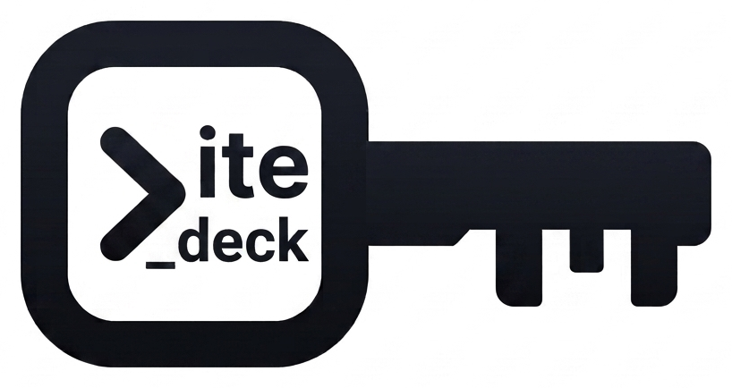
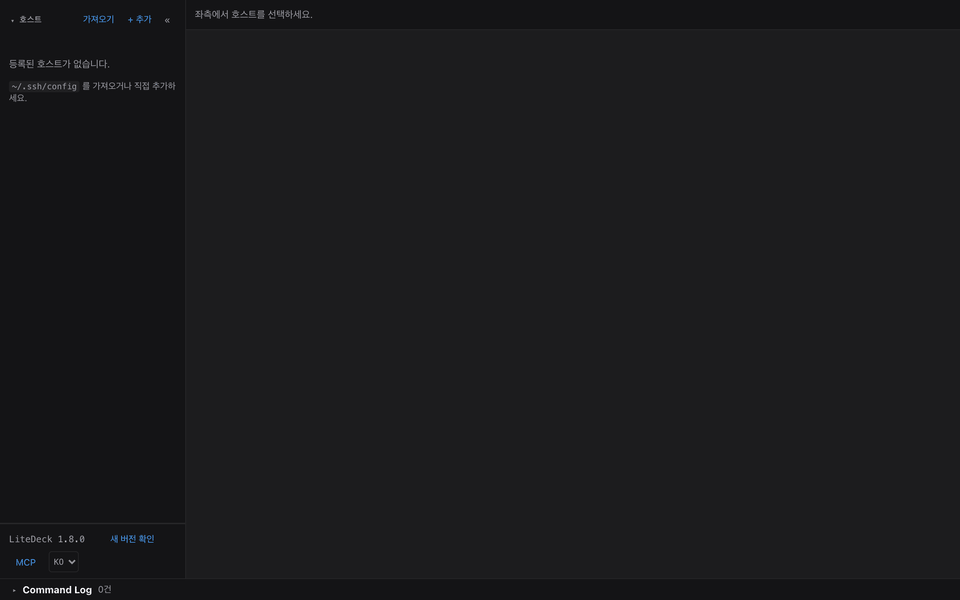

<p align="center">
  <picture>
    <source media="(prefers-color-scheme: dark)" srcset="docs/logo-dark.png">
    
  </picture>
</p>

<h1 align="center">LiteDeck</h1>

<p align="center">
  <b>A desktop app for managing the servers you reach over SSH, in one window</b><br>
  Nothing gets installed on the server
</p>

<p align="center">
  <a href="https://github.com/cpprhtn/LiteDeck/actions/workflows/ci.yml"></a>
  <a href="https://github.com/cpprhtn/LiteDeck/releases"></a>
  <a href="LICENSE"></a>
  
</p>

<p align="center">
  <a href="README.md">한국어</a> · <b>English</b>
</p>

<p align="center">
  <a href="#install">Download</a> ·
  <a href="docs/features.en.md">Features</a> ·
  <a href="docs/security.en.md">Security</a> ·
  <a href="docs/mcp.en.md">MCP</a> ·
  <a href="docs/support.en.md">What's verified</a> ·
  <a href="CONTRIBUTING.md">Contributing</a>
</p>

<p align="center">
  
</p>

<p align="center">
  <sub>One connection covers <b>files, the editor, services, processes, containers, the network, sessions, monitoring and a terminal</b>.<br>
  Nothing was installed on the server.</sub>
</p>

---

## What it does

Connect to a server over SSH once, and all of this is in the same window.

| | |
|---|---|
| **Files** | Browse, upload, download, transfer whole folders. An interrupted transfer resumes |
| **Editing** | A syntax-highlighting editor that shows you the difference from what is on the server before it saves |
| **Services · processes · containers** | systemd units and Windows services, a task-manager-style process table, Docker and Podman containers and Compose projects |
| **Monitoring** | CPU, memory, disk, network and NVIDIA GPUs, with trends over time and system events |
| **Security · sessions** | Firewall and fail2ban status, who is connected right now, a summary of failed logins |
| **Terminal** | A built-in terminal. Commands that open a file, like `vi nginx.conf`, open it in the app's editor instead |
| **Settings sync** <sub>v2.3.0</sub> | Export your host list and approval policies as one encrypted file and take it to another machine |

The full list, with the detail, is in [the feature document](docs/features.en.md).

## Why LiteDeck

1. **Nothing to install on the server.** No agent, daemon or package — it works over the SSH port you already have open. What is left on the server is whatever you asked it to do
2. **It shows you the commands it ran.** Everything you do on screen is recorded in the Command Log as the actual command. When something needs administrator rights (sudo), it asks first rather than adding it on its own
3. **No account to sign up for.** Nothing about your use is collected, and the whole source is public
4. **Lightweight.** Not Electron. About a 6 MB download and 15 MB installed, and it starts in under a second (measured on v2.3.0; the macOS build is an Intel/Apple Silicon universal binary, so 12 MB and 29 MB there)

## Install and connect

Grab a build from the [releases page](https://github.com/cpprhtn/LiteDeck/releases).

| File | For |
|---|---|
| `litedeck-desktop-macos.zip` | macOS (universal, Intel and Apple Silicon) |
| `litedeck-desktop-windows-amd64.zip` | Windows 10/11 (amd64). Unzip to a single `litedeck.exe`, no installer |
| `litedeck-desktop-linux-amd64.tar.gz` | Linux (amd64). **Ubuntu 24.04 or newer** — it needs `libwebkit2gtk-4.1`. On 22.04, [build from source](docs/building.en.md) |

> [!WARNING]
> **These builds are not code-signed.** Signing and notarisation both cost money, so early releases ship unsigned, and
> the SHA256 checksums published alongside them **are not a substitute for a signature.** If you need that assurance,
> [build from source](docs/building.en.md).
>
> That is also why the first launch trips macOS Gatekeeper and Windows SmartScreen. How to get past
> both is in [Install and server setup](docs/install.en.md).

**First connection**

1. Open the app and press **+ Add** at the top left. If you use `~/.ssh/config`, **Import** brings those hosts in at once
2. Enter the address, the user and how to log in (SSH agent, key file or password)
3. The first time you connect to a server, you are asked to confirm its host key fingerprint. Confirm it and the server's tabs open

**On the server side.** Linux needs nothing if you can already SSH into it. Windows needs the OpenSSH
server switched on. To reach a machine at home from outside, a mesh VPN beats opening a port on your
router — [preparing the server](docs/install.en.md#preparing-the-server) ·
[reaching it over Tailscale](docs/remote-access.en.md)

**Use it from a web browser — server mode.** Instead of the desktop app, you can put LiteDeck on one
server and open it in a web browser — `litedeck-server-linux-amd64.tar.gz` ·
`litedeck-server-linux-arm64.tar.gz`. In that case LiteDeck runs as a web server and has a login
page. Running it, exposing it and setting up the login are covered in
[server mode](docs/server-mode.en.md).

## MCP — working your servers through an AI tool

MCP clients such as Claude Code and Claude Desktop can read and change your servers through LiteDeck.
They use **the same SSH connection** as the screen, and the commands they run land in **the same
Command Log**. Nothing is installed on the server for this either.

- 12 read tools and 6 write tools
- **File changes are confirmed before they happen, by default.** The dialog shows the difference from
  what is on the server right now. Per server, you can raise that to confirming every change
- The approval policy is set per server in LiteDeck, and cannot be changed from the AI client's side
- Files an AI changed can be rolled back
- Running commands and deleting files are switched on per server, and are off by default <sub>v1.7.0</sub>.
  Once on, they follow the same approval policy as the other write tools

```bash
claude mcp add --transport http litedeck http://127.0.0.1:<port>/mcp \
  --header "Authorization: Bearer <token>"
```

→ [MCP integration](docs/mcp.en.md)

## Where it runs

> [!NOTE]
> **Runs on macOS, Windows and Ubuntu** — all three confirmed by opening it there. What was tested
> where is written down in [What is and is not verified](docs/support.en.md).
> Try the irreversible actions — deleting files, killing processes — on a throwaway server first.
>
> The documentation is primarily maintained in Korean; this file is kept in step with it.

- **Servers it manages**: Linux with systemd (Ubuntu, Debian, Raspberry Pi and so on) and Windows
  (with the OpenSSH server). Windows servers get the sessions and security tabs; the events tab is not
  there yet
- **Machines it runs on**: macOS, Windows 10/11, Linux (Ubuntu 24.04 or newer)

**When this is the right tool**

- You run somewhere between two and six servers yourself. You read logs, restart services and fix
  config files on them
- You do not want to install anything else on those servers. SSH is already open, and you would
  like that to be enough
- You want a GUI, but you still want to see what it ran
- You are not giving up your terminal. You just want the frequent things to be a click

If you need dozens of servers at once, declarative state, or a real remote development environment,
something else is better. Which cases those are is written down in
[when it is not](docs/support.en.md#when-it-is-not).

## Further reading

| | |
|---|---|
| [Security](docs/security.en.md) | Host key verification, authentication, credential storage, sudo, the MCP endpoint. **What it cannot do comes first** |
| [What is and is not verified](docs/support.en.md) | What was checked where, and what was not. Plus when this is not the right tool, and the non-goals |
| [MCP integration](docs/mcp.en.md) | 18 tools, the approval policy, undo, the safeguards |
| [Features in detail](docs/features.en.md) | **The full feature list**, plus the Command Log, the editor, transfers, Compose, the sshd check and ProxyJump |
| [Install and server setup](docs/install.en.md) | Getting past the first-launch warning, enabling OpenSSH on Windows |
| [Reaching a machine over Tailscale](docs/remote-access.en.md) | Your home machine without port forwarding. Tailscale SSH, MCP, subnet routers, and doing it without an account |
| [Build from source](docs/building.en.md) | Building and testing |

## Contributing

See [CONTRIBUTING.md](CONTRIBUTING.md). The design goal is that **supporting a new server OS means writing one adapter**, which is how Windows support landed. OpenRC (Alpine), launchd (macOS) and FreeBSD are all open.

Found a vulnerability? Please email **cpprhtn@naver.com** rather than opening a public issue.

## License

[Apache-2.0](LICENSE)
