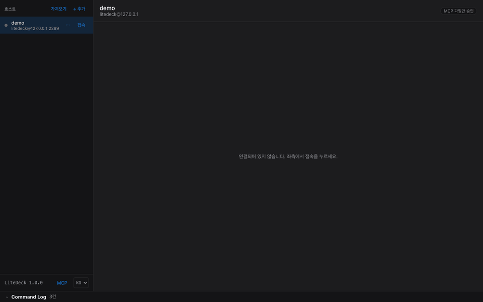
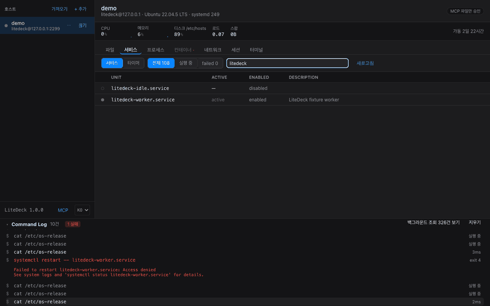
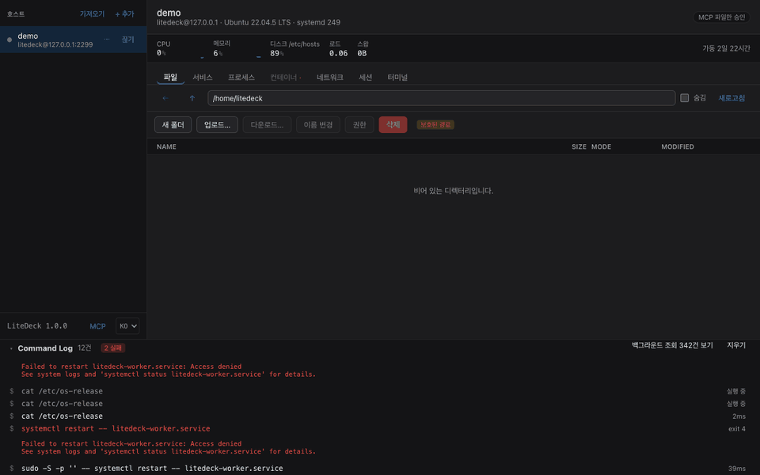

<p align="center">
  <picture>
    <source media="(prefers-color-scheme: dark)" srcset="docs/logo-dark.png">
    
  </picture>
</p>

<h1 align="center">LiteDeck</h1>

<p align="center">
  <b>서버에는 아무것도 설치하지 않고, SSH 하나로 원격 서버를 로컬 네이티브 GUI에서 다룹니다.</b>
</p>

<p align="center">
  <a href="https://github.com/cpprhtn/LiteDeck/actions/workflows/ci.yml"></a>
  <a href="https://github.com/cpprhtn/LiteDeck/releases"></a>
  <a href="LICENSE"></a>
  
</p>

<p align="center">
  <b>한국어</b> · <a href="README.en.md">English</a>
</p>

<p align="center">
  <a href="#설치">다운로드</a> ·
  <a href="#기능">기능</a> ·
  <a href="#지원-범위">지원 범위</a> ·
  <a href="CONTRIBUTING.md">기여하기</a>
</p>

<p align="center">
  
</p>

<p align="center">
  <sub>접속 · 설정 파일 열기 · 편집 · <b>저장 전 diff</b>. 서버에는 아무것도 설치하지 않았습니다.</sub>
</p>

---

> [!NOTE]
> **v1.0.0.** macOS·Windows 클라이언트와 **Windows·Linux 실제 장비**에서 검증했습니다.
> 다만 Linux 실기에서 확인한 것은 조회 계통과 파일 읽기·쓰기까지이고, 전송·권한 상승 같은 나머지는
> 아직 컨테이너에서만 돌렸습니다. 무엇이 확인됐고 무엇이 안 됐는지는 [지원 범위](#지원-범위)에 그대로 적어두었습니다.
> 운영 중인 서버에 쓰신다면 삭제·프로세스 종료처럼 되돌릴 수 없는 작업은 먼저 시험용 서버에서 확인해보세요.

## 화면을 보내지 않습니다

RDP·VNC·TeamViewer는 서버의 **화면 픽셀을 영상으로 스트리밍**합니다. LiteDeck은 그러지 않습니다.

```
[GUI 조작]              [LiteDeck]                  [서버 · 설치물 없음]
폴더 더블클릭    ───→   SFTP ReadDir          ───→   sftp-server 서브시스템
서비스 재시작    ───→   systemctl restart     ───→   systemd가 실행
컨테이너 삭제    ───→   docker rm -f <id>     ───→   dockerd가 실행
                 ←───  구조화된 텍스트/JSON   ←───
화면 그리기: 100% 로컬 PC
```

서버가 하는 일은 **원래 갖고 있던 명령을 실행하고 텍스트를 돌려주는 것뿐**입니다. 그래서:

- **마우스 반응은 로컬 앱 속도입니다.** 네트워크 지연은 데이터 갱신에만 영향을 줍니다
- **서버 부하는 명령이 실행되는 순간 외에는 없습니다**
- **설치물도, 추가 포트도, 중계 서버도 없습니다.** 22번 포트 하나면 됩니다

## 5가지 원칙

1. **서버 무설치.** 에이전트·데몬·패키지를 설치하지 않습니다. 서버에 남는 것은 사용자가 시킨 일의 결과뿐입니다[^tmp]
2. **SSH만 사용.** 포트 하나만 씁니다. 웹서버도, 중계 서버도 없습니다
3. **파일 그 이상.** 파일뿐 아니라 프로세스·서비스·컨테이너·상태까지 GUI로 다룹니다
4. **로그인 없음, 수집 없음, 오픈소스.** 계정을 요구하지 않고, 아무것도 수집하지 않으며, 전체 소스가 공개됩니다
5. **가볍게.** Electron을 쓰지 않습니다. 받는 파일 5~10MB, 설치 후 13~16MB, 실행까지 1초 이내

[^tmp]: 정확히 하자면, 편집기로 파일을 저장할 때 같은 디렉터리에 임시 파일을 만들고 `rename`으로
    갈아끼웁니다. 저장이 중간에 끊겨도 원본이 반토막 나지 않게 하려는 것이고, 성공하면 임시 파일은
    남지 않습니다. `rename`이 실패하면 임시 파일 경로를 화면에 알려주고 지우지 않습니다.
    잃어버리는 것보다 낫기 때문입니다.

## 기능

| | |
|---|---|
| **파일** | 트리 탐색·업로드·다운로드(진행률·취소)·이름 변경·삭제·권한(체크박스 + `chmod 755` 직접 입력) |
| **코드 편집** | 트리 옆 분할 뷰 · 파일 탭 · 문법 강조 24종 · 찾기/바꾸기 · **저장 전 diff** · **원자적 저장**(임시 파일 + rename). **서버에도 클라이언트에도 편집기를 깔지 않습니다** |
| **서비스** | systemd 유닛 / Windows 서비스. 목록·필터·시작/중지/재시작·자동 시작 설정·**실시간 로그 보기**(Linux) |
| **프로세스** | 작업 관리자식 테이블. 정렬·검색·트리 보기·종료(TERM→KILL 2단계)·우선순위 변경 |
| **컨테이너** | Docker·Podman 카드. 시작/중지/재시작/삭제·**실시간 로그 보기**·이미지/볼륨 정리 |
| **네트워크** | 인터페이스와 열린 포트. **외부에 노출된 포트를 구분해서 표시** |
| **스케줄** | systemd 타이머. 다음·마지막 실행 시각 |
| **터미널** | xterm.js PTY, 탭 여러 개. `code .` · `vi foo.conf` 를 **앱이 가로채** 파일 탭에서 엽니다. 서버로 보내지 않으므로 VS Code 나 vi 가 없어도 됩니다 |
| **모니터링** | CPU·메모리·디스크 요약 바 + 그래프 |
| **Command Log** | GUI가 실행한 **모든 명령을 실시간으로 표시**. 클릭하면 복사됩니다 |
| **MCP** | Claude Code·Claude Desktop 이 이 앱을 통해 서버를 조회하고 바꿉니다. 서버별 opt-in, 변경은 승인, **되돌리기 가능** |
| **언어** | 한국어·영어. 처음 열 때 OS 언어를 따르고, 사이드바 아래 `KO`/`EN` 로 바꿉니다 |

### Command Log: GUI로 CLI를 배웁니다

<p align="center">
  
</p>

<p align="center"><sub>재시작이 권한 부족으로 거부되자 <b>물어봅니다</b>. 실행된 명령은 그대로 보이고, 비밀번호는 stdin 으로 가서 보이지 않습니다.</sub></p>


운영 서버를 만지는 GUI는 결국 "믿어달라"고 요구하는 셈입니다. LiteDeck은 **방금 무엇을 실행했는지 정확히 보여주는 것**으로 그 신뢰를 얻습니다.

```
$ systemctl list-units --type=service --all --output=json               120ms
$ journalctl -u myapp.service -n 200 -f --no-pager -q
$ sudo -S -p '' -- systemctl restart -- myapp.service                   310ms
$ powershell -EncodedCommand ⟨utf8 prelude⟩ Restart-Service -Name 'Spooler' -Force
```

비밀번호는 표준 입력으로 전달되므로 **명령줄을 그대로 보여줘도 안전합니다.** 이 기록은 로컬에만 남고 외부로 나가지 않습니다.

### 편집기: 양쪽 어디에도 설치가 없습니다

원격 파일을 고치려면 보통 둘 중 하나를 깝니다. 서버에 `vscode-server`(수백 MB)를 올리거나,
서버의 `vi`·`nano`를 터미널로 쓰거나. LiteDeck은 **둘 다 안 합니다.**

- **서버 쪽.** 아무것도 필요 없습니다. 파일은 SSH가 이미 제공하는 SFTP로 읽고 씁니다.
  서버에 편집기가 없어도, 있어도 상관없습니다
- **클라이언트 쪽.** VS Code를 설치할 필요가 없습니다. 편집기가 앱 안에 들어 있습니다
  (CodeMirror, 문법 24종). 첫 파일을 열 때 로드되므로 디렉터리만 보다 끄면 비용이 없습니다

터미널에서 `code .` 이나 `vi foo.conf` 를 치면 **앱이 그 줄을 서버로 보내기 전에 가로채**
파일 탭으로 이동합니다. 서버는 이 기능의 존재를 모릅니다. 그래서 서버에 VS Code도 vi도
없어도 되고, 반대로 **서버 쪽에서 무언가 열리는 일도 없습니다.**

저장은 서버 현재 내용과의 diff를 먼저 보여주고, 임시 파일에 쓴 뒤 `rename`으로 갈아끼웁니다.
저장이 중간에 끊겨도 원본이 반토막 나지 않습니다.

> 대비: VS Code Remote-SSH는 서버에 서버를 설치합니다. 저사양 VPS에서 `vscode-server`가
> 메모리를 잡아먹는 것은 잘 알려진 문제입니다. 본격 원격 IDE가 필요하면 그쪽이 정답이고,
> **설정 파일 하나 고치자고 수백 MB를 올리기 싫을 때** 이쪽이 답입니다.

## 이 도구가 맞는 경우

- **서버 두세 대에서 대여섯 대**를 직접 돌본다. 로그를 보고, 서비스를 재시작하고, 설정 파일을 고친다
- 그 서버에 **뭔가를 더 깔고 싶지 않다.** SSH 는 이미 열려 있고, 그것으로 끝내고 싶다
- GUI 는 원하지만 **무엇이 실행됐는지는 보고 싶다**
- 터미널을 버릴 생각은 없다. 자주 하는 일만 클릭으로 하고 싶을 뿐이다

## 안 맞는 경우

솔직하게 적습니다. 아래에 해당하면 다른 도구가 낫습니다.

| 필요한 것 | 맞는 도구 |
|---|---|
| 서버 수십·수백 대를 한 번에 | Ansible, Salt 같은 구성 관리 |
| 선언적 상태 관리 | Terraform, Ansible |
| 본격적인 원격 개발 (LSP·디버거·리팩터링) | VS Code Remote-SSH |
| GUI 앱 화면 자체가 필요 | RDP, VNC |
| SSH 외 프로토콜 (RDP·VNC·Kubernetes·Proxmox) | 여러 프로토콜을 다루는 접속 관리 도구 |
| 파일 전송만 | WinSCP, SFTP 클라이언트, `rsync` |

LiteDeck 은 **SSH 하나로 닿는 서버 몇 대를, 설치물 없이, 무엇이 실행되는지 보면서** 다루는 데
집중합니다. 그 밖의 것은 위 도구들이 더 잘합니다.

## 설치

[릴리스 페이지](https://github.com/cpprhtn/LiteDeck/releases)에서 받으세요.

| 파일 | 대상 |
|---|---|
| `litedeck-macos.zip` | macOS (Intel·Apple Silicon 공용) |
| `litedeck-windows-amd64.zip` | Windows 10/11 (amd64). 압축을 풀면 `litedeck.exe` 하나, 설치 없이 바로 실행 |
| `litedeck-linux-amd64.tar.gz` | Linux (amd64) |

> [!WARNING]
> **현재 릴리스는 코드 서명이 되어 있지 않습니다.** 서명·공증에는 비용이 들어 초기에는 미서명으로 배포하며,
> 함께 올리는 SHA256 체크섬은 **서명을 대신하지 못합니다.** 신뢰가 필요하면 [직접 빌드](#소스에서-빌드)하세요.

### 첫 실행: 경고 넘기기

**macOS 15 (Sequoia) 이상.** `Apple could not verify "litedeck" is free of malware…` 가 뜹니다. 이 창에는 "휴지통으로 이동"과 "취소"밖에 없습니다.

**시스템 설정 → 개인정보 보호 및 보안** 을 열고 아래로 내려가면 `"litedeck"이(가) 차단되었습니다` 옆에 **"그래도 열기"** 가 있습니다. 한 번 누르면 이후로는 그냥 열립니다. 터미널이 빠르면:

```bash
xattr -d com.apple.quarantine /Applications/litedeck.app
```

> 흔히 안내되는 **우클릭 → 열기** 는 macOS 15부터 Apple이 없앴습니다. 14 이하에서만 통합니다.

**Windows.** SmartScreen이 `Windows에서 PC를 보호했습니다` 를 띄웁니다. **추가 정보 → 실행** 을 누르면 됩니다. WebView2가 없으면 설치 안내가 나옵니다.

**Defender가 파일을 지울 수 있습니다.** 서명되지 않은 새 실행 파일에는 평판 정보가 없어서, 다운로드 직후 경고 없이 격리되기도 합니다. 바이러스가 아니라 **서명이 없기 때문**이며, 서명·공증에는 비용이 들어 초기 릴리스는 미서명으로 배포합니다.

지워졌다면 **Windows 보안 → 바이러스 및 위협 방지 → 보호 기록** 에서 해당 항목의 **작업 → 허용** 으로 복원할 수 있습니다. 미리 막으려면 같은 화면의 **설정 관리 → 제외 항목 추가** 에 압축 푼 폴더를 등록하세요.

**Linux.** 별도 절차 없이 압축을 풀고 실행 권한만 주면 됩니다.

```bash
tar xzf litedeck-linux-amd64.tar.gz && chmod +x litedeck && ./litedeck
```

## 서버 준비

**Linux.** 이미 SSH로 접속하고 계시면 준비는 끝났습니다. 추가 설정이 없습니다.

**Windows.** OpenSSH 서버만 켜면 됩니다. 관리자 PowerShell에서:

```powershell
Add-WindowsCapability -Online -Name OpenSSH.Server~~~~0.0.1.0
Start-Service sshd
Set-Service -Name sshd -StartupType Automatic
```

기본 셸이 cmd.exe든 PowerShell이든 상관없습니다. LiteDeck은 명령을 `-EncodedCommand` 로 보내므로 셸의 따옴표 규칙에 영향을 받지 않습니다.

**집에 있는 PC를 밖에서 다루려면** 포트포워딩 대신 Tailscale 같은 메시 VPN을 쓰는 편이 낫습니다.
설정 순서와, 계정 없이 가는 방법(Headscale·WireGuard)은 [docs/remote-access.md](docs/remote-access.md)에 적어두었습니다.

## 보안

SSH로 운영 서버에 붙는 도구라, 아래 내용은 설계 의도가 아니라 **지금 코드가 실제로 하는 일**입니다.
해당 파일을 같이 적어두었으니 직접 확인하셔도 됩니다.

### 호스트 키 검증

**합니다.** OpenSSH 형식 `known_hosts`로 검증합니다 ([`internal/sshcore/hostkey.go`](internal/sshcore/hostkey.go)).

- 처음 보는 호스트라면 주소·키 종류·**SHA256 지문**을 띄우고 사용자가 고릅니다: 거부 / 이번만 / 항상 신뢰.
  "항상"을 골랐을 때만 파일에 기록합니다
- **기록된 키와 다른 키가 오면 연결을 끊습니다.** 전면 경고가 뜨고, **그 지점을 넘어가는 선택지는
  코드 어디에도 없습니다.** 사용자에게 묻지도 않습니다. 중간자 공격의 서명이기 때문입니다
- 파일 권한은 디렉터리 `0700`, 파일 `0600`

> [!IMPORTANT]
> **LiteDeck은 `~/.ssh/known_hosts`를 쓰지 않습니다.** 자기 파일
> (`<OS 설정 디렉터리>/litedeck/known_hosts`)을 따로 씁니다. 그래서 `ssh`로 이미 접속해 본
> 서버라도 LiteDeck에서는 처음 한 번 다시 물어봅니다. 형식이 같으므로 기존 줄을 복사해 넣으면
> 그 과정을 건너뛸 수 있습니다.

### 인증

ssh-agent · 개인키 파일(패스프레이즈 지원) · 비밀번호 · keyboard-interactive(2FA·OTP)를 지원하고,
**시도 순서는 호스트마다 직접 정합니다.**

- **ssh-agent를 맨 앞에 두는 걸 권합니다.** 키가 이 프로세스 안으로 들어오지 않습니다
- OTP·2FA 응답은 **저장하지 않습니다.** 일회용 코드는 두 번째엔 쓸모가 없습니다

### 자격증명 저장

저장한다면 **OS 자격증명 저장소에만** 들어갑니다. macOS 키체인, Windows 자격 증명 관리자,
Linux Secret Service ([`internal/secret/secret.go`](internal/secret/secret.go)).

- **LiteDeck 자기 파일에는 비밀을 절대 쓰지 않습니다.** 자격증명 저장소를 못 찾으면 더 약한
  형식으로 떨어지는 게 아니라 **저장을 포기합니다.** 매번 묻고, "기억하기" 체크박스 자체를
  띄우지 않습니다. 지킬 수 없는 약속을 UI에 두지 않으려는 것입니다
- 저장은 프롬프트마다 선택입니다. 호스트마다 **저장된 비밀번호 지우기**가 있습니다
- 서버에서 비밀번호가 바뀌어 sudo 인증이 실패하면 **저장분을 스스로 지웁니다.** 안 그러면
  키체인이 다이얼로그보다 먼저 답해서, 사용자가 고칠 방법 없이 영원히 실패합니다
- `hosts.json`에는 주소·사용자·키 파일 **경로**만 들어갑니다. 비밀은 없습니다

### sudo

**자동으로 붙지 않습니다** ([`internal/app/sudo.go`](internal/app/sudo.go)). 명령은 로그인한
사용자 권한으로 나갑니다. 서버가 거부하면 "관리자 권한으로 재시도"를 **물어보고**, 사용자가
눌러야 실행합니다. 몰래 sudo를 붙이면 Command Log가 사용자가 믿는 것과 달라지는데,
그 로그가 이 앱을 신뢰할 유일한 근거입니다.

- 비밀번호는 **stdin으로만** 갑니다: `sudo -S -p '' -- <cmd>`. argv에 넣으면 그 서버의 모든
  사용자가 프로세스 테이블에서 볼 수 있고 Command Log에도 그대로 남습니다. **그래서 Command Log가
  명령줄을 그대로 보여줘도 안전한 것입니다**
- `sudo -n true`로 NOPASSWD를 감지하면 아예 묻지 않습니다. 서버가 원하지도 않는 비밀번호를 묻는 것은
  무의미할 뿐 아니라 **아무 다이얼로그에나 비밀번호를 치는 습관을 들입니다**

### MCP 엔드포인트

[MCP 연동](#mcp-연동)을 켜면 로컬에 HTTP 엔드포인트가 하나 열립니다. 그것 하나가 **공유된 모든
서버를 대변하므로**, 여기 적는 것이 그 기능의 안전을 좌우합니다
([`internal/mcp/http.go`](internal/mcp/http.go)).

- **`127.0.0.1` 에만 바인딩합니다.** 다른 인터페이스로 여는 설정을 두지 않았습니다. 옵션이 없다는 것 자체가
  이 엔드포인트를 안전하게 만드는 유일한 근거이기 때문입니다
- **Bearer 토큰.** 설정에 저장되고, 상수 시간으로 비교하며, **재발급 버튼으로만** 바뀝니다.
  앱이 마음대로 돌리면 붙여넣어 둔 클라이언트 설정이 사용자가 고르지 않은 순간에 깨집니다
- **Origin 검사.** 브라우저 페이지가 루프백으로 POST 할 수 있고, DNS 리바인딩이 그걸 동일 출처처럼
  보이게 만듭니다. MCP 명세가 이걸 요구하는 이유이고, 실제 MCP 클라이언트는 Origin 을 안 보냅니다
- **레이트 리밋** 초당 1.5회·순간 8회. 예의가 아니라 기능입니다. Exec 채널이 3개뿐이라 에이전트
  버스트는 서버를 느리게 하는 게 아니라 **사용자가 보고 있는 GUI 를 굶깁니다**
- **서버별 opt-in, 파일 삭제는 또 따로.** 호스트를 등록해도, 읽기를 공유해도 삭제 권한은 안 생깁니다
- **결재 정책은 앱이 소유합니다.** 그걸 바꾸는 도구도, 완화하는 파라미터도 없습니다.
  **모델이 자기 승인을 요청할 방법이 없습니다.** 프로토콜에 클라이언트 의도를 실을 자리가 없다는 것을 Claude Code 2.1.22 로 실측해 확인했습니다
- **되돌리기 사본은 이 컴퓨터에** 쌓이고 24시간 뒤 사라집니다. 서버에는 아무것도 안 남습니다

**정직하게 적어둘 것:**

- **"안 묻기"를 켜면 prompt injection 이 이깁니다.** 서버 로그나 파일에 심긴 지시문이 모델을
  조종할 수 있고, 그 모드에서는 사람이 볼 기회가 없습니다. 남는 것은 방어가 아니라 **귀속과 폭발
  반경**입니다: Command Log 전량 기록, 모드의 시한부 만료, 호스트별 적용
- **되돌릴 수 있는 것은 파일뿐입니다.** 서비스 재시작이나 프로세스 종료는 사본이 없습니다.
  다시 시작하면 되는 종류라 넣었고, 되돌릴 수 없는 것(임의 명령 실행, 디렉터리 재귀 삭제,
  컨테이너·이미지 삭제)은 아예 제공하지 않습니다
- **자격증명은 MCP 계층이 만지지 않습니다.** 토큰은 이 엔드포인트에만 쓰이고, SSH 자격증명은
  위에 적은 대로 OS 키체인에 있습니다

### 못 하는 것을 먼저 적어둡니다

- **비밀번호가 메모리에 남는 시간을 보장하지 못합니다.** Go 문자열은 불변이고 런타임이 언제든
  복사할 수 있어 원하는 시점에 지울 수 없습니다. `x/crypto/ssh`도 비밀번호를 문자열로 받습니다.
  쓰고 나면 가비지가 되어 다음 수집 때 회수되지만, **요청 즉시 0으로 덮는 동작은 구현돼 있지
  않습니다.** 코어 덤프나 힙 덤프에서는 보일 수 있습니다
- **릴리스 바이너리는 서명돼 있지 않습니다.** SHA256 체크섬은 서명이 아닙니다
- **Linux 서버 검증은 아직 컨테이너뿐입니다.** 자세한 것은 [지원 범위](#지원-범위)에 있습니다
- 감사 로그 같은 건 없습니다. Command Log는 이 컴퓨터에만 남고 어디로도 가지 않습니다.
  **클라이언트가 쓰는 로그는 감사가 아닙니다**
- 의존성 취약점은 `main` 푸시와 모든 PR에서 `govulncheck ./...`로 확인합니다

취약점을 발견하셨다면 공개 이슈 대신 **cpprhtn@naver.com** 으로 보내주세요.

## 지원 범위

**검증된 것과 검증되지 않은 것을 구분해서** 적습니다. 아래 "미검증"은 코드가 없다는 뜻이 아니라, 저자가 실제로 돌려보지 않았다는 뜻입니다.

### 검증됨

| | 어디서 | 무엇을 |
|---|---|---|
| **클라이언트** | macOS 26.5.2 (arm64) | 개발·실행·전 기능. 릴리스 바이너리 실행까지 확인 |
| **클라이언트** | Windows | 릴리스 `litedeck.exe` 실행 확인 |
| **서버** | **Windows 10 Pro / PowerShell 5.1 (실제 장비)** | 서비스·프로세스·네트워크·모니터링. 실제 장비입니다 |
| **서버** | **Ubuntu 24.04.4 (실제 장비)** | 조회 전 계통(모니터링·서비스·failed 판정·컨테이너·노출 포트·저널)과 파일 읽기/쓰기/삭제. 권한 부족 시 거절 경로까지 |
| **서버** | Ubuntu 22.04.5 / systemd 249 | 전체 흐름: 서비스(JSON 경로)·파일·프로세스·타이머·로그 보기·권한 상승 |
| **서버** | Ubuntu 20.04.6 / systemd 245 | 서비스 **표 파싱 폴백** (JSON 미지원 버전) |
| **서버** | Alpine 3.20 + OpenSSH | 전송 계층: SFTP·재연결·명령 주입 방어·동시 세션 |
| **컨테이너** | docker 28 (dind) | 컨테이너·이미지·볼륨 |

**실제 Linux 장비에서 확인한 것은 위 한 줄이 전부입니다.** Ubuntu 24.04.4 서버를 MCP 연동으로
돌려 조회 계통과 파일 읽기·쓰기·삭제까지 왕복했습니다. **GUI 로 직접 쓰는 경로**(파일 전송,
sudo 권한 상승 완료, 터미널 PTY, 실시간 로그 따라가기)**는 아직 컨테이너에서만** 확인했습니다
(`testdata/`).

Linux 클라이언트는 **빌드·링크만** 확인했습니다. Ubuntu 22.04는 `libwebkit2gtk-4.0.so.37`, 24.04는 `libwebkit2gtk-4.1.so.0`에 연결되는 것까지입니다. 창을 띄워보지는 않았습니다.

### 미검증

| | 상태 |
|---|---|
| **실제 Linux 장비의 쓰기 경로** | 파일 전송·sudo 승격 완료·터미널 PTY·로그 따라가기는 컨테이너에서만 확인 |
| **Linux 클라이언트 실행** | 링크만 확인, 창을 띄워보지 않음 |
| **Debian, RHEL·Rocky 8** | systemd 245 표 파싱 경로를 공유하므로 동작이 예상되나 확인 안 됨 |
| **Podman** | `docker` 호환 CLI라 파서를 공유하지만 실행 안 해봄 |
| **Windows 컨테이너** | 테스트한 장비에 Docker가 없었음 |
| **ProxyJump·다단 SSH** | 미구현 |
| **macOS·BSD 서버** | 어댑터 없음. 연결하면 **파일과 터미널만** 동작하고, 나머지 탭은 이유를 화면에 적습니다 |
| **원격 → 로컬 드래그** | Wails v2에 드래그 아웃 API가 없어 구현 불가. 다운로드 버튼으로 대체 |

여기 없는 조합에서 돌려보셨다면 [이슈](https://github.com/cpprhtn/LiteDeck/issues)로 알려주세요.

### 서버 OS는 어떻게 정해지나

`uname -s` 로 물어보고, 답하지 않으면 PowerShell로 `Win32_OperatingSystem` 을 조회합니다. 그 응답 자체가 Windows라는 증거이면서 `Windows 10 Pro` 같은 이름도 함께 옵니다.

systemd 246 미만(Ubuntu 20.04, RHEL 8)에는 JSON 출력이 없어 **표 파싱으로 자동 전환**합니다. 버전을 감지해 형식을 고르므로 사용자가 신경 쓸 것은 없습니다.

어댑터가 없는 OS에 연결해도 **파일과 터미널은 그대로 열립니다.** SFTP와 PTY는 SSH가 직접 제공하므로 어댑터가 필요 없기 때문입니다. 나머지 탭은 어떤 OS로 확인됐는지와 함께 이유를 화면에 적습니다.

## MCP 연동

<p align="center">
  
</p>

<p align="center"><sub>MCP 클라이언트가 파일을 고치려 하자 <b>서버의 현재 내용 대비 diff</b> 가 뜹니다. 승인한 것은 되돌릴 수 있습니다.</sub></p>


Claude Code·Claude Desktop 같은 MCP 클라이언트가 이 앱을 통해 서버를 **조회하고 바꿉니다.**
사이드바 아래 **MCP** 버튼에서 켭니다.

> [!IMPORTANT]
> **변경은 기본적으로 매번 물어봅니다.** 승인창에는 실제로 실행될 명령이나 파일 diff 가
> 그대로 뜹니다. 그 결재 정책은 **앱이 소유하며 클라이언트 쪽에서는 끌 수 없습니다.**

```
Claude Code  ──MCP(로컬 HTTP)──▶  LiteDeck  ──기존 SSH 연결──▶  서버
```

MCP 클라이언트는 **GUI 가 앉던 자리에 앉습니다.** 같은 어댑터, 이미 인증된 같은 SSH 연결,
같은 Command Log 를 씁니다. 거기서 나온 명령은 `MCP` 표시로 흐릅니다.
서버 쪽에는 여전히 **아무것도 설치하지 않습니다.** Claude Code 를 서버에 깔면
런타임과 상주 프로세스가 생기고, 컨텍스트 수집용 파일 탐색이 저사양 서버의 I/O 를
때립니다. 그 부하는 전부 클라이언트가 집니다.

**조회 12개**: `hosts_list` · `health_snapshot` · `sys_stats` · `svc_list` · **`svc_logs`** ·
`proc_list` · `container_list` · **`container_logs`** · `net_ports` · `fs_list` · `fs_read` ·
`sessions_list`. `health_snapshot` 하나로 CPU·메모리·디스크·failed 유닛·비정상 컨테이너·
외부 노출 포트가 한 번에 오고, `svc_logs` 가 **왜** 죽었는지를 말해줍니다.

**변경 5개**: `svc_control`(시작/중지/재시작) · `container_control` · `proc_signal`(TERM/KILL) ·
`fs_write` · `fs_delete`.

**되돌릴 수 있습니다.** MCP 가 파일을 덮어쓰거나 지우기 전에 이전 내용을 **이 컴퓨터에** 보관하고,
MCP 패널의 **바뀐 파일** 탭에서 파일별로 되돌립니다. 안 묻기로 두고 자리를 비웠을 때 방어 대신
남는 것이 이것입니다. **24시간이 지나면 알아서 지워집니다.** 하룻밤을 위한 가드지 보관소가 아닙니다.
서버에는 아무것도 남기지 않고, `fs_delete` 는 사본을 못 남기면(바이너리·초대형) 아예 거부합니다.

**파일 삭제는 서버별로 따로 켭니다.** 읽기 공유·변경 승인과 별개인데, *도구가 존재하는가* 와
*쓸 때 물어보는가* 는 다른 질문이기 때문입니다.

**일부러 안 넣은 것**: 임의 명령 실행, 디렉터리 재귀 삭제, 컨테이너·이미지 삭제입니다.
임의 명령이 있으면 도구별 허용 설정이 장식이 되고, 나머지 셋은 사본을 남길 수 없어
되돌리기가 성립하지 않습니다.

**안전장치**

| | |
|---|---|
| 서버별 opt-in | **기본 전부 꺼짐.** 호스트를 등록해도 MCP 는 못 봅니다. 앱에서 켠 것만 읽힙니다. 파일 삭제는 또 따로 켭니다 |
| 변경 결재 | 기본은 **파일 변경만 물어봄**. 승인창이 서버 현재 내용 대비 diff 를 보여주는데, 그건 클라이언트가 가질 수 없는 정보이기 때문입니다. 재시작 등은 클라이언트가 이미 같은 걸 보여줬으므로 그냥 실행합니다 |
| 호스트별 조절 | 헤더의 배지에서 **전부 물어보기 / 파일만 / 밤새 안 묻기**. 통과 모드는 배지가 붉게 남고 **시간이 지나면 스스로 돌아옵니다** |
| 원격에서 못 바꿈 | 그 스위치를 켜는 도구도, 완화하는 파라미터도 없습니다. **모델이 자기 승인을 요청할 방법이 없습니다** |
| 읽기 ≠ 쓰기 | 읽으라고 공유해도 바꿀 수 있게 되지는 않습니다 |
| 바인딩 | `127.0.0.1` 전용. 외부 인터페이스로 여는 설정이 없습니다 |
| 인증 | Bearer 토큰. 설정에 저장되고, 재발급 버튼으로만 바뀝니다 |
| 레이트 리밋 | 초당 1.5회, 순간 8회. 에이전트 루프가 서버를 때리지 못하게 |
| 감사 | 모든 도구 호출이 Command Log 에 남습니다. 로컬에만, 어디로도 안 갑니다 |

**연결하기.** MCP 패널의 **연결** 탭에서 **복사** 를 누르고 붙여넣으면 끝입니다.

```bash
claude mcp add --transport http litedeck http://127.0.0.1:<포트>/mcp \
  --header "Authorization: Bearer <토큰>"
```

> [!NOTE]
> **검증 상태.** Claude Code 2.1.22 가 이 엔드포인트에 붙는 것(`✓ Connected`)과,
> 프로토콜 전 구간(initialize·tools/list·tools/call·거부·인증·레이트 리밋)이
> 실제로 동작하는 것까지 확인했습니다. **모델이 스스로 도구를 호출하는 것은
> 저자가 확인하지 못했습니다.** 확인 환경의 제약이었고, 여러분 터미널에서는
> 위 한 줄이면 됩니다. 결과를 알려주시면 이 문구를 고치겠습니다.

## 하지 않는 것

- **화면 스트리밍.** 구조화된 상태를 내놓지 못하는 대상(GUI 앱·디자이너·디버거)은 RDP가 정답이고, LiteDeck은 그 영역을 대체하려 하지 않습니다
- **구성 관리.** 선언적 상태 관리는 Ansible·Terraform의 영역입니다. LiteDeck은 그때그때 명령을 내리는 도구입니다
- **서버 상주 감시.** inotify 같은 실시간 감시는 에이전트가 필요하므로 원칙 1에 어긋납니다
- **다수 서버 일괄 관리.** 서버 2~5대를 다루는 도구입니다. 수십 대를 한꺼번에 다루는 건 다른 제품의 일입니다

## 소스에서 빌드

```bash
# 필요: Go 1.25+, Node 20+, Wails v2
#
# Go가 더 낮아도 됩니다. Go 1.21+ 라면 `go build`가 필요한 툴체인을 스스로
# 받아옵니다(GOTOOLCHAIN=auto, 기본값). Ubuntu 22.04의 기본 Go 1.18만 아니면
# 별도 조치가 필요 없습니다.
go install github.com/wailsapp/wails/v2/cmd/wails@latest

git clone https://github.com/cpprhtn/LiteDeck.git
cd LiteDeck
wails build          # build/bin/ 에 생성됩니다
wails dev            # 핫 리로드 개발 모드
```

Linux는 웹뷰 개발 헤더와 C 컴파일러가 필요합니다(웹뷰가 cgo로 연결됩니다):

```bash
sudo apt install build-essential pkg-config libgtk-3-dev

# 배포판에 따라 webkit 패키지 이름이 다릅니다
sudo apt install libwebkit2gtk-4.1-dev   # 24.04 이상 (wails build -tags webkit2_41)
sudo apt install libwebkit2gtk-4.0-dev   # 22.04     (태그 불필요)
```

## 개발

```bash
go test ./... -short          # 유닛 테스트 (Docker 불필요)
go test ./... -race           # 통합 테스트 포함 (Docker 필요)
```

통합 테스트는 실제 서버를 띄웁니다. `testdata/`에 sshd·systemd·Docker-in-Docker 픽스처가 있습니다. Docker가 없으면 실패가 아니라 건너뛰므로, **`-race`가 몇 초 만에 끝났다면 통합 테스트가 안 돌았다는 뜻입니다** (Docker가 켜져 있으면 1분 남짓 걸립니다).

v1.0.0을 만든 환경: Go 1.26.5 · Node 22.13.1 · Wails 2.13.0 · Docker 29.4.0 (macOS 26.5.2 arm64).

## 기여

[CONTRIBUTING.md](CONTRIBUTING.md)를 참고하세요. **새 서버 OS 지원 = 어댑터 하나 구현**이 되도록 설계돼 있습니다. Windows 지원도 그렇게 붙었습니다. OpenRC(Alpine)·launchd(macOS)·FreeBSD가 비어 있습니다.

## 라이선스

[Apache-2.0](LICENSE)
