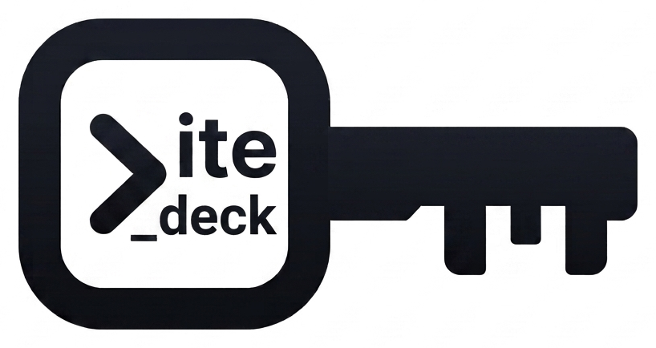

<p align="center">
  <picture>
    <source media="(prefers-color-scheme: dark)" srcset="docs/logo-dark.png">
    
  </picture>
</p>

<h1 align="center">LiteDeck</h1>

<p align="center">
  <b>서버에는 아무것도 설치하지 않고, SSH 하나로 원격 서버를 로컬 네이티브 GUI에서 다룹니다.</b>
</p>

<p align="center">
  <a href="https://github.com/cpprhtn/LiteDeck/actions/workflows/ci.yml"></a>
  <a href="https://github.com/cpprhtn/LiteDeck/releases"></a>
  <a href="LICENSE"></a>
  
</p>

<p align="center">
  <b>한국어</b> · <a href="README.en.md">English</a>
</p>

<p align="center">
  <a href="#설치">다운로드</a> ·
  <a href="#기능">기능</a> ·
  <a href="#지원-범위">지원 범위</a> ·
  <a href="CONTRIBUTING.md">기여하기</a>
</p>

---

> [!NOTE]
> **v0.1.6-beta** — macOS·Windows 클라이언트와, Windows 실제 장비 및 Linux 컨테이너에서 검증했습니다.
> 아직 실제 Linux 장비에서는 돌려보지 않았습니다. 무엇이 확인됐고 무엇이 안 됐는지는 [지원 범위](#지원-범위)에 그대로 적어두었습니다.
> 운영 중인 서버에 쓰신다면 삭제·프로세스 종료처럼 되돌릴 수 없는 작업은 먼저 시험용 서버에서 확인해보세요.

## 화면을 보내지 않습니다

RDP·VNC·TeamViewer는 서버의 **화면 픽셀을 영상으로 스트리밍**합니다. LiteDeck은 그러지 않습니다.

```
[GUI 조작]              [LiteDeck]                  [서버 — 설치물 없음]
폴더 더블클릭    ───→   SFTP ReadDir          ───→   sftp-server 서브시스템
서비스 재시작    ───→   systemctl restart     ───→   systemd가 실행
컨테이너 삭제    ───→   docker rm -f <id>     ───→   dockerd가 실행
                 ←───  구조화된 텍스트/JSON   ←───
화면 그리기: 100% 로컬 PC
```

서버가 하는 일은 **원래 갖고 있던 명령을 실행하고 텍스트를 돌려주는 것뿐**입니다. 그래서:

- **마우스 반응은 로컬 앱 속도** — 네트워크 지연은 데이터 갱신에만 영향을 줍니다
- **서버 부하는 명령이 실행되는 순간 외에는 없습니다**
- **설치물도, 추가 포트도, 중계 서버도 없습니다** — 22번 포트 하나면 됩니다

## 5가지 원칙

1. **서버 무설치** — 에이전트·데몬·패키지를 설치하지 않고, 서버에 파일을 남기지 않습니다
2. **SSH만 사용** — 포트 하나만 씁니다. 웹서버도, 중계 서버도 없습니다
3. **파일 그 이상** — 파일뿐 아니라 프로세스·서비스·컨테이너·상태까지 GUI로 다룹니다
4. **로그인 없음, 수집 없음, 오픈소스** — 계정을 요구하지 않고, 아무것도 수집하지 않으며, 전체 소스가 공개됩니다
5. **가볍게** — Electron을 쓰지 않습니다. 바이너리 약 11MB, 실행까지 1초 이내

## 기능

| | |
|---|---|
| **파일** | 트리 탐색·업로드·다운로드(진행률·취소)·이름 변경·삭제·권한(체크박스 + `chmod 755` 직접 입력) |
| **코드 편집** | 트리 옆 분할 뷰 · 파일 탭 · 문법 강조 24종 · 찾기/바꾸기 · **저장 전 diff** · **원자적 저장**(임시 파일 + rename) |
| **서비스** | systemd 유닛 / Windows 서비스 — 목록·필터·시작/중지/재시작·자동 시작 설정·**실시간 로그 보기**(Linux) |
| **프로세스** | 작업 관리자식 테이블 — 정렬·검색·트리 보기·종료(TERM→KILL 2단계)·우선순위 변경 |
| **컨테이너** | Docker·Podman 카드 — 시작/중지/재시작/삭제·**실시간 로그 보기**·이미지/볼륨 정리 |
| **네트워크** | 인터페이스와 열린 포트 — **외부에 노출된 포트를 구분해서 표시** |
| **스케줄** | systemd 타이머 — 다음·마지막 실행 시각 |
| **터미널** | xterm.js PTY, 탭 여러 개. `code .` · `vi foo.conf` 를 **앱이 가로채** 파일 탭에서 엽니다 — 서버로 보내지 않으므로 VS Code 나 vi 가 없어도 됩니다 |
| **모니터링** | CPU·메모리·디스크 요약 바 + 그래프 |
| **Command Log** | GUI가 실행한 **모든 명령을 실시간으로 표시**. 클릭하면 복사됩니다 |
| **언어** | 한국어·영어. 처음 열 때 OS 언어를 따르고, 사이드바 아래 `KO`/`EN` 로 바꿉니다 |

### Command Log — GUI로 CLI를 배웁니다

운영 서버를 만지는 GUI는 결국 "믿어달라"고 요구하는 셈입니다. LiteDeck은 **방금 무엇을 실행했는지 정확히 보여주는 것**으로 그 신뢰를 얻습니다.

```
$ systemctl list-units --type=service --all --output=json               120ms
$ journalctl -u myapp.service -n 200 -f --no-pager -q
$ sudo -S -p '' -- systemctl restart -- myapp.service                   310ms
$ powershell -EncodedCommand ⟨utf8 prelude⟩ Restart-Service -Name 'Spooler' -Force
```

비밀번호는 표준 입력으로 전달되므로 **명령줄을 그대로 보여줘도 안전합니다.** 이 기록은 로컬에만 남고 외부로 나가지 않습니다.

## 다른 도구와의 차이

| | LiteDeck | Termius | Cockpit | SSHFS·WinSCP |
|---|---|---|---|---|
| 서버 설치 | **불필요** | 불필요 | **필요** | 불필요 |
| 추가 포트 개방 | **없음** | 없음 | **9090** | 없음 |
| 파일 | ✅ | ✅ | ✅ | ✅ |
| 서비스·프로세스·컨테이너 | ✅ | ❌ | ✅ | ❌ |
| 계정 가입 강제 | **없음** | 있음 | 없음 | 없음 |
| 사용 정보 수집 | **없음** | 있음 | 없음 | 없음 |
| 가격 | **무료·오픈소스** | 핵심 기능 유료 | 무료 | 무료 |

## 설치

[릴리스 페이지](https://github.com/cpprhtn/LiteDeck/releases)에서 받으세요.

| 파일 | 대상 |
|---|---|
| `litedeck-macos.zip` | macOS — Intel·Apple Silicon 공용 |
| `litedeck-windows-amd64.zip` | Windows 10/11 (amd64) — 압축을 풀면 `litedeck.exe` 하나, 설치 없이 바로 실행 |
| `litedeck-linux-amd64.tar.gz` | Linux (amd64) |

> [!WARNING]
> **현재 릴리스는 코드 서명이 되어 있지 않습니다.** 서명·공증에는 비용이 들어 초기에는 미서명으로 배포하며,
> 함께 올리는 SHA256 체크섬은 **서명을 대신하지 못합니다.** 신뢰가 필요하면 [직접 빌드](#소스에서-빌드)하세요.

### 첫 실행 — 경고 넘기기

**macOS 15 (Sequoia) 이상** — `Apple could not verify "litedeck" is free of malware…` 가 뜹니다. 이 창에는 "휴지통으로 이동"과 "취소"밖에 없습니다.

**시스템 설정 → 개인정보 보호 및 보안** 을 열고 아래로 내려가면 `"litedeck"이(가) 차단되었습니다` 옆에 **"그래도 열기"** 가 있습니다. 한 번 누르면 이후로는 그냥 열립니다. 터미널이 빠르면:

```bash
xattr -d com.apple.quarantine /Applications/litedeck.app
```

> 흔히 안내되는 **우클릭 → 열기** 는 macOS 15부터 Apple이 없앴습니다. 14 이하에서만 통합니다.

**Windows** — SmartScreen이 `Windows에서 PC를 보호했습니다` 를 띄웁니다. **추가 정보 → 실행** 을 누르면 됩니다. WebView2가 없으면 설치 안내가 나옵니다.

**Defender가 파일을 지울 수 있습니다.** 서명되지 않은 새 실행 파일에는 평판 정보가 없어서, 다운로드 직후 경고 없이 격리되기도 합니다. 바이러스가 아니라 **서명이 없기 때문**이며, 서명·공증에는 비용이 들어 초기 릴리스는 미서명으로 배포합니다.

지워졌다면 **Windows 보안 → 바이러스 및 위협 방지 → 보호 기록** 에서 해당 항목의 **작업 → 허용** 으로 복원할 수 있습니다. 미리 막으려면 같은 화면의 **설정 관리 → 제외 항목 추가** 에 압축 푼 폴더를 등록하세요.

**Linux** — 별도 절차 없이 압축을 풀고 실행 권한만 주면 됩니다.

```bash
tar xzf litedeck-linux-amd64.tar.gz && chmod +x litedeck && ./litedeck
```

## 서버 준비

**Linux** — 이미 SSH로 접속하고 계시면 준비는 끝났습니다. 추가 설정이 없습니다.

**Windows** — OpenSSH 서버만 켜면 됩니다. 관리자 PowerShell에서:

```powershell
Add-WindowsCapability -Online -Name OpenSSH.Server~~~~0.0.1.0
Start-Service sshd
Set-Service -Name sshd -StartupType Automatic
```

기본 셸이 cmd.exe든 PowerShell이든 상관없습니다. LiteDeck은 명령을 `-EncodedCommand` 로 보내므로 셸의 따옴표 규칙에 영향을 받지 않습니다.

## 지원 범위

**검증된 것과 검증되지 않은 것을 구분해서** 적습니다. 아래 "미검증"은 코드가 없다는 뜻이 아니라, 저자가 실제로 돌려보지 않았다는 뜻입니다.

### 검증됨

| | 어디서 | 무엇을 |
|---|---|---|
| **클라이언트** | macOS 26.5.2 (arm64) | 개발·실행·전 기능. 릴리스 바이너리 실행까지 확인 |
| **클라이언트** | Windows | 릴리스 `litedeck.exe` 실행 확인 |
| **서버** | **Windows 10 Pro / PowerShell 5.1 (실제 장비)** | 서비스·프로세스·네트워크·모니터링. 유일하게 컨테이너가 아닌 실제 장비입니다 |
| **서버** | Ubuntu 22.04.5 / systemd 249 | 전체 흐름 — 서비스(JSON 경로)·파일·프로세스·타이머·로그 보기·권한 상승 |
| **서버** | Ubuntu 20.04.6 / systemd 245 | 서비스 **표 파싱 폴백** (JSON 미지원 버전) |
| **서버** | Alpine 3.20 + OpenSSH | 전송 계층 — SFTP·재연결·명령 주입 방어·동시 세션 |
| **컨테이너** | docker 28 (dind) | 컨테이너·이미지·볼륨 |

**Linux 서버 검증은 전부 컨테이너입니다** (`testdata/`). 실제 Linux 장비나 클라우드 서버에서는 아직 돌려보지 않았습니다.

Linux 클라이언트는 **빌드·링크만** 확인했습니다 — Ubuntu 22.04는 `libwebkit2gtk-4.0.so.37`, 24.04는 `libwebkit2gtk-4.1.so.0`에 연결되는 것까지입니다. 창을 띄워보지는 않았습니다.

### 미검증

| | 상태 |
|---|---|
| **실제 Linux 장비** | Linux 검증은 컨테이너만 사용 |
| **Linux 클라이언트 실행** | 링크만 확인, 창을 띄워보지 않음 |
| **Debian, RHEL·Rocky 8** | systemd 245 표 파싱 경로를 공유하므로 동작이 예상되나 확인 안 됨 |
| **Podman** | `docker` 호환 CLI라 파서를 공유하지만 실행 안 해봄 |
| **Windows 컨테이너** | 테스트한 장비에 Docker가 없었음 |
| **ProxyJump·다단 SSH** | 미구현 |
| **macOS·BSD 서버** | 어댑터 없음. 연결하면 **파일과 터미널만** 동작하고, 나머지 탭은 이유를 화면에 적습니다 |
| **원격 → 로컬 드래그** | Wails v2에 드래그 아웃 API가 없어 구현 불가. 다운로드 버튼으로 대체 |

여기 없는 조합에서 돌려보셨다면 [이슈](https://github.com/cpprhtn/LiteDeck/issues)로 알려주세요.

### 서버 OS는 어떻게 정해지나

`uname -s` 로 물어보고, 답하지 않으면 PowerShell로 `Win32_OperatingSystem` 을 조회합니다 — 그 응답 자체가 Windows라는 증거이면서 `Windows 10 Pro` 같은 이름도 함께 옵니다.

systemd 246 미만(Ubuntu 20.04, RHEL 8)에는 JSON 출력이 없어 **표 파싱으로 자동 전환**합니다. 버전을 감지해 형식을 고르므로 사용자가 신경 쓸 것은 없습니다.

어댑터가 없는 OS에 연결해도 **파일과 터미널은 그대로 열립니다** — SFTP와 PTY는 SSH가 직접 제공하므로 어댑터가 필요 없기 때문입니다. 나머지 탭은 어떤 OS로 확인됐는지와 함께 이유를 화면에 적습니다.

## 하지 않는 것

- **화면 스트리밍** — 구조화된 상태를 내놓지 못하는 대상(GUI 앱·디자이너·디버거)은 RDP가 정답이고, LiteDeck은 그 영역을 대체하려 하지 않습니다
- **구성 관리** — 선언적 상태 관리는 Ansible·Terraform의 영역입니다. LiteDeck은 그때그때 명령을 내리는 도구입니다
- **서버 상주 감시** — inotify 같은 실시간 감시는 에이전트가 필요하므로 원칙 1에 어긋납니다
- **다수 서버 일괄 관리** — 서버 2~5대를 다루는 도구입니다. 수십 대를 한꺼번에 다루는 건 다른 제품의 일입니다

## 소스에서 빌드

```bash
# 필요: Go 1.25+, Node 20+, Wails v2
#
# Go가 더 낮아도 됩니다 — Go 1.21+ 라면 `go build`가 필요한 툴체인을 스스로
# 받아옵니다(GOTOOLCHAIN=auto, 기본값). Ubuntu 22.04의 기본 Go 1.18만 아니면
# 별도 조치가 필요 없습니다.
go install github.com/wailsapp/wails/v2/cmd/wails@latest

git clone https://github.com/cpprhtn/LiteDeck.git
cd LiteDeck
wails build          # build/bin/ 에 생성됩니다
wails dev            # 핫 리로드 개발 모드
```

Linux는 웹뷰 개발 헤더와 C 컴파일러가 필요합니다(웹뷰가 cgo로 연결됩니다):

```bash
sudo apt install build-essential pkg-config libgtk-3-dev

# 배포판에 따라 webkit 패키지 이름이 다릅니다
sudo apt install libwebkit2gtk-4.1-dev   # 24.04 이상 — wails build -tags webkit2_41
sudo apt install libwebkit2gtk-4.0-dev   # 22.04     — 태그 불필요
```

## 개발

```bash
go test ./... -short          # 유닛 테스트 (Docker 불필요)
go test ./... -race           # 통합 테스트 포함 (Docker 필요)
```

통합 테스트는 실제 서버를 띄웁니다 — `testdata/`에 sshd·systemd·Docker-in-Docker 픽스처가 있습니다. Docker가 없으면 실패가 아니라 건너뛰므로, **`-race`가 몇 초 만에 끝났다면 통합 테스트가 안 돌았다는 뜻입니다** (Docker가 켜져 있으면 1분 남짓 걸립니다).

v0.1.6-beta를 만든 환경: Go 1.26.5 · Node 22.13.1 · Wails 2.13.0 · Docker 29.4.0 (macOS 26.5.2 arm64).

## 기여

[CONTRIBUTING.md](CONTRIBUTING.md)를 참고하세요. **새 서버 OS 지원 = 어댑터 하나 구현**이 되도록 설계돼 있습니다 — Windows 지원도 그렇게 붙었습니다. OpenRC(Alpine)·launchd(macOS)·FreeBSD가 비어 있습니다.

## 라이선스

[Apache-2.0](LICENSE)
