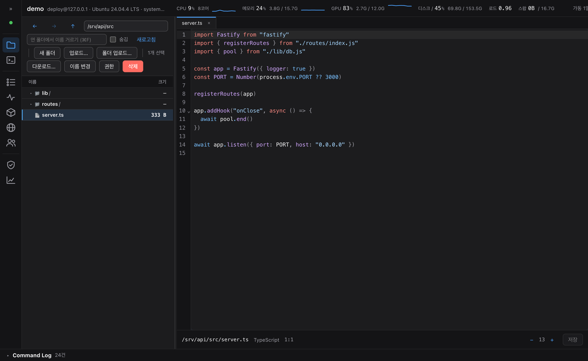
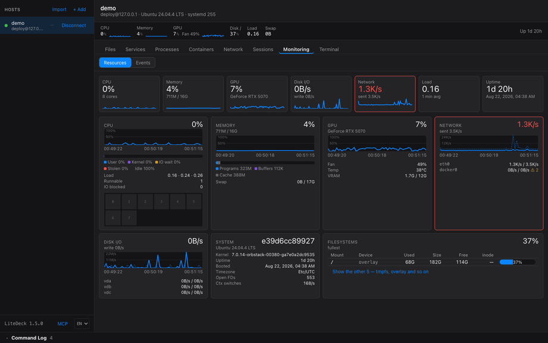

# Features in detail

[← README](../README.en.md)

## At a glance

| | |
|---|---|
| **Files** | Browse as a tree, **filter by name**, upload, download (with progress, cancel and **resume after an interruption**), whole folders, rename, delete, permissions (checkboxes or `chmod 755` typed directly). Files the editor will not open come up **read-only** — images are drawn, anything else shows its opening bytes as hex |
| **Code editing** | Split view beside the tree, file tabs, syntax highlighting for 24 languages, find/replace, **a diff before every save**, **atomic saves** (temp file + rename) |
| **Services** | systemd units / Windows services. List, filter, start/stop/restart, set start-at-boot, **live log tailing** (Linux) |
| **Processes** | A task-manager table. Sort, search, tree view, terminate (TERM then KILL), change priority |
| **Containers** | Docker and Podman cards. Start/stop/restart/remove, **live log tailing**, image and volume cleanup. Anything Compose started is **grouped by project** and can be started, stopped or restarted as one |
| **Network** | Interfaces and listening ports. **Flags which ones are reachable from outside**. Reviews the sshd configuration |
| **Sessions** | Who is logged in to this server, and cutting any of them off. Successful logins also appear in the security tab, where **addresses not seen before** are marked. **Login history and failed attempts** — successes from wtmp, failures from the journal. Failures run into the thousands a day, so they arrive summarised by IP and account rather than listed |
| **Scheduled jobs** | systemd timers. Next and last run |
| **Terminal** | xterm.js PTY, multiple tabs. `code .` and `vi foo.conf` are **caught by the app** and open in the file tab. They are never sent to the server, so neither VS Code nor vi needs to exist there |
| **Monitoring** | The bar is the glance, the monitoring tab is a dashboard. CPU is **split into user, kernel, IO wait and steal** — 90% that is all IO wait means the disk, and all steal means the hypervisor. **A core die**, memory with cache and buffers separated out, and NVIDIA cards add **utilisation, fan, temperature and VRAM** (nvidia-smi) |
| **Infrastructure metrics** | **Inodes** (a disk with room that cannot create a file), **network error and drop** counters, **disk I/O**, **PSI** — how long things waited rather than how much was used — runnable and blocked counts, open descriptors. All of it read from `/proc` and `df`, so **there is still nothing installed on the server** |
| **Trends** | CPU, memory and GPU over time for as long as the app was watching. **Stretches it did not see are drawn as breaks**, never joined up |
| **Command history** | A panel beside the terminal tab: **which directory, and what ran there**, as folder cards ordered by recency — Recent, All and Raw. Three sources (sudo's journal, this app's terminal, the shell's history file) shown apart rather than merged. The journal's path is recorded and therefore certain; a history file's path is recovered by replaying `cd`, and every card says whether it is **exact** or **inferred**. Each relative move is checked against the server, so a session seam cannot produce a `project/project/project` that exists nowhere. Reading the shell history is **enabled per server**, and anything that looks like a password is masked in Go |
| **While you were away** | Opening a host shows one line on **what changed since you last looked**. The monitoring tab carries **how many security updates are pending and whether a reboot is needed** — two files read, no root and no commands |
| **Security** | **What is guarding this box, and whether it works.** Firewalls (ufw, nftables, iptables, firewalld) and fail2ban read from **three places — the unit, the config file and the kernel** — with any disagreement shown rather than resolved; a server whose unit was up and whose firewall was off is a real case. **Packets dropped** and the rise since you last looked, the block list (fail2ban's entries kept apart from hand-made ones), 24 hours of failures with ban moments marked, and who is still getting through. The config file is **compared against what is running**, which is what catches a fail2ban that needs restarting |
| **Events** | What happened, and when. **OOM kills**, failed units, core dumps, scheduled restarts, reboot boundaries. Read from the systemd journal and classified by `MESSAGE_ID` rather than by wording, so the server's language does not matter |
| **Command Log** | **Every command the GUI runs, live.** Click to copy |
| **MCP** | Claude Code and Claude Desktop read and change your servers through this app. Per-server opt-in, changes are approved, **and can be undone** |
| **Connecting** | Password, key, agent, 2FA. Import from `~/.ssh/config`. One **ProxyJump** hop |
| **Language** | English and Korean. Uses whichever you last chose, or your OS language if you never have. Switch with `KO`/`EN` at the bottom of the sidebar |

## The shell

<p align="center">
  
</p>

**⌘B folds the left column down to a 52px icon strip** — and you can still switch
server and section from it. The two bands that used to sit across the top are one
row now, so at 1440×900 the editor went from 823×691 to 1071×748: 41% more area.

- **Nine horizontal tabs became a grouped vertical rail** — Work, System, Observe.
  A view the server cannot serve is marked with a dot rather than greyed out; grey
  tells nobody why, and the view itself explains
- **The file tab from the keyboard.** `↑` `↓` to move, `Enter` to open (into a folder,
  or into the editor), `F2` to rename, `⌘←` `⌘→` back and forward, `⌘↑` for the parent.
  `Alt` on Windows
- **One lock per connection, not per tab.** Unlock in the security tab and the network
  tab shows process names too — the same permission is not asked for twice
- **`Escape` closes every dialog.** Anything irreversible ignores a click outside:
  a stray click is not an answer
- **Text that was invisible in light mode.** Chart ticks were 9px at 2.36:1 contrast.
  The palette was redrawn, and **a test now holds it there**
- **One timestamp shape** — `2026-09-09 12:23`, the same one the server's own logs
  print, so there is nothing to translate between them

## Automatic updates

One check ten seconds after launch. When there is a newer release the same button
becomes *Update to 2.2.0*; pressing it downloads the release, checks it against
`SHA256SUMS.txt`, and turns into *Install update* — **which only ever runs when
somebody presses it.** Silently replacing an unsigned binary is the shape of a
supply-chain attack. Passwords in the OS keychain are kept.

There is no timer after that. An app somebody opens to do one thing and closes has
no reason to poll github all afternoon.

## Windows servers

The same questions as Linux, answered from evidence that has nothing in common
with it.

**Pick a shell** — cmd, PowerShell or WSL. sshd hands out whatever
`HKLM\SOFTWARE\OpenSSH\DefaultShell` says, which is cmd on a stock install. WSL
distributions come from the registry (`Lxss`) rather than from `wsl -l`, because on
a machine with no distribution that command prints its help and exits zero — 98
lines on the box this was measured against, every one of which a line-per-
distribution parser turns into a menu entry.

Bare `wsl.exe -d X` is never run. Under ConPTY it hangs and leaves LxssManager
wedged for the whole machine until it reboots, so it is always given a command. The
wake-up check **waits for one already running rather than starting another** —
leaving one behind per press of the button was what wedged the service.

**Sessions** — a session is the sshd child owned by a real account. `SYSTEM` owns
the listener and the per-connection parent; `sshd_NNNN` owns a stranger who has not
authenticated yet. The client address cannot come from the socket table, which
attributes every connection on port 22 to the listener, so it is matched by time
against the OpenSSH event log.

**Security** — three firewall profiles, the inbound rules that open a port, the
account lockout policy and Defender. The policy is read with `secedit /export`
rather than `net accounts`: the latter is localised, so a parser keyed on its
labels reads a Korean machine as having no policy at all.

**Not yet** — the events tab. The Windows event log sits where journald does, but
nothing reads it.

## Command Log: learn the CLI from the GUI

<p align="center">
  
</p>

<p align="center"><sub>A restart is refused for want of privileges, so the app <b>asks</b>. The command it ran stays visible; the password went over stdin and does not.</sub></p>


A GUI that touches a production server is asking you to trust it. LiteDeck earns that by **showing exactly what it just ran**.

```
$ systemctl list-units --type=service --all --output=json               120ms
$ journalctl -u myapp.service -n 200 -f --no-pager -q
$ sudo -S -p '' -- systemctl restart -- myapp.service                   310ms
$ powershell -EncodedCommand ⟨utf8 prelude⟩ Restart-Service -Name 'Spooler' -Force
```

Passwords go over stdin, so **the command line is safe to display verbatim**. The log stays on your machine and is never sent anywhere.

## The editor: nothing installed on either end

<p align="center">
  
</p>

<p align="center"><sub>Typing <code>code .</code> is caught <b>before the line reaches the server</b> and opens the file tab instead. <code>vi</code> on a new path opens an editor tab. Neither VS Code nor vi needs to exist on the server.</sub></p>


Editing a remote file usually means installing something. Either `vscode-server` goes on the
server (hundreds of MB), or you live in the server's `vi` through a terminal. LiteDeck does
**neither.**

- **On the server.** Nothing is needed. Files are read and written over SFTP, which SSH
  already provides. Whether the server has an editor at all makes no difference
- **On your machine.** You do not need VS Code. The editor ships inside the app (CodeMirror,
  24 language modes) and loads when you open the first file, so browsing a directory and
  quitting costs nothing

Typing `code .` or `vi foo.conf` in the terminal is **caught by the app before the line reaches
the server**, and the file tab opens instead. The server never learns this feature exists. So
neither VS Code nor vi has to be installed there, and equally **nothing opens on the server side.**

<p align="center">
  
</p>

<p align="center"><sub>Opening a file from the tree puts a syntax-highlighted editor beside it. Pressing save brings up <b>a diff against what is on the server right now</b>.</sub></p>

Once you accept it, the write goes to a temp file and swaps in with `rename`, so an interrupted
save cannot leave the original half-written.

> For contrast: VS Code Remote-SSH installs a server on your server. `vscode-server` eating
> memory on a small VPS is a well-known problem. If you want a real remote IDE, that is the right
> tool. **If you do not want to upload hundreds of megabytes to change one config file**, this is.

## Filtering the tree by name

Type part of a name in the box beside the address bar (`⌘F` · `Ctrl+F`) and the listing narrows.

**Nothing is asked of the server.** It filters the listings the app already holds, so typing as fast
as you like costs the server nothing. Folders you have opened once are searched even when collapsed,
so a file inside one surfaces with the path leading to it.

The trade is that **folders you have never opened are not searched.** A remote `find` would reach
them, but that is work the server pays for, and it is the side of the line this tool stays on. When
nothing matches, the screen says so.

## Transfers: whole folders, and resuming after an interruption

Directories go up and down in one piece. The queue gets **one row per tree**, not one per file, and
that row says which file it is on.

The server's share of the cost was the design constraint. Both walking the tree and moving it are
**SFTP and nothing else** — no `find`, no `tar`, so no process starts on the server. The walk runs
inside the job, which means **the Cancel button reaches it**: pick the wrong directory by accident
and there is a way to stop.

**An interrupted transfer picks up where it stopped.** SFTP addresses every read and write with an
absolute offset, so continuing is one seek — there is no Range header to negotiate. The hard part is
knowing that what you are about to append to came from the same file, and LiteDeck checks it twice:

- the source's **size and timestamp** are the ones recorded when the transfer was queued
- the **64KB immediately before the resume point is read back from both sides and compared**

The second check earns its keep because SFTP carries mtime in **whole seconds**. A file rebuilt to
the same length inside the same second is indistinguishable by size and timestamp alone. If the
bytes at the seam disagree, the resume is refused and the half-finished file is deleted.

> This checks the seam, not the whole prefix. Verifying every byte already transferred would mean
> reading the source in full, which is the download resuming exists to avoid. **A source edited to
> exactly the same length, only outside that 64KB window, would still get through.** Written down
> because a limit nobody states is a limit people trust past.

**Folder transfers resume too**, with the file as the unit. A tree writes each file straight to its
final name, so a resume **skips the files that already arrived and rewrites only the one that was in
flight**, from the start. There is no seam to append to, so the 64KB check above does not apply here.

> The skipped files are taken on trust. If the source changed after the interruption, those files
> keep the copy that was already made. Comparing sizes instead would not help — a file edited to
> exactly the same length is what defeats that. What the resume does guarantee is the numbering: it
> reuses **the list the first walk built**, so a file created or deleted in between cannot shift the
> index and make it skip the wrong one.

## Compose: act on the project, not one container

Containers Compose started are grouped by project, and the group header carries buttons
that act on all of it.

| Where you press | What runs |
|---|---|
| Start/Stop/Restart on a card | `docker start·stop·restart <id>` — that one container |
| Start/Stop/Restart all, on the group header | `docker compose --project-name <p> start·stop·restart` |

**Nothing asks you for a scope.** Where you press is the scope. Asking was considered and
rejected: on a server run mostly through Compose that puts a dialog on nearly every click,
while the common case is still one container — which teaches people to dismiss the dialog
without reading it.

Acting on the project takes the other services with it, so the containers it will touch
are listed first and confirmed — **from what is already on screen, so the confirmation
costs the server nothing.**

The count on the header is the whole project regardless of the filter. A number that
disagreed with what the button next to it touches would be a lie.

**Working out which project a container belongs to costs no extra command.** Compose
writes the answer into labels, and those labels are already in the `docker ps` output the
card list is built from. Finding the project by searching the filesystem, or by calling
`docker inspect` per container, would turn one listing into twenty round trips on a
server running twenty containers.

**The compose file is never read.** The project is addressed by name alone, and Compose
recovers the rest from the labels on the running containers. So this still works when the
file sits somewhere this account cannot read, or is no longer there at all — which is the
ordinary case for something deployed to a server from a source tree kept elsewhere.

There is no `down`, `up` or `run`. Those do a different kind of thing than restart, and
do not belong beside it.

## Reviewing the sshd configuration

Below the network tab, LiteDeck reads the server's sshd configuration and says what is worth
knowing: `PermitRootLogin yes`, `PermitEmptyPasswords yes`, a low `MaxSessions`, and so on.

**It does not run `sshd -T`.** That would give the effective configuration with every default filled
in — and it needs root, and a read-only view that demands a password before it shows you anything is
a view nobody opens. Instead the files are **read over the SFTP that is already open**: they are
world-readable everywhere they ship, and not a single command runs.

The cost of that trade is this. **It knows what the files declare.** Where
they are silent, sshd's built-in default applies, and that differs between distributions (Debian's
`PermitRootLogin` is not upstream's), so nothing is guessed.

Two things it gets right that are easy to get wrong. **A value under `Match` is not the server's
setting** — reporting the `PermitRootLogin yes` beneath `Match Address 10.0.0.0/8` as though it
applied to everyone is the classic misreading of this file. And **sshd keeps the first value it
reads**, the opposite of most config formats, which is why distributions put their `Include` at the
top of the file.

## ProxyJump: one hop through a bastion

Put `jump@bastion:22` in the host editor's ProxyJump field and that server is dialled first.

A bastion is **a server you log in to**, so it is treated as one: **its fingerprint is confirmed
separately and its password asked for separately.** A ProxyJump that skips the bastion's host key
hands the whole session to whoever answers on that port, which is the thing the hop was there to
prevent. The target's own host key is checked exactly as it would be otherwise — the bastion
forwards bytes, it does not vouch for who is on the other end of them.

One hop. A chain is **refused, not quietly truncated to its first host**: connecting somewhere other
than what you wrote is worse than not connecting.

The bastion's sshd needs `AllowTcpForwarding yes`. With it off, sshd refuses with
`administratively prohibited`, which reads as a problem with your account and sends people looking
at the wrong machine — so LiteDeck says **which server and which setting** instead.

## The monitoring tab

<p align="center">
  
</p>

When the summary bar says **CPU 40%**, this tab says **what the 40% is**.

- **CPU split into user, kernel, IO wait and steal.** 90% that is all IO wait is not short of CPU, it is waiting for a disk; all steal is not busy at all, its hypervisor is handing the time to somebody else. Before they are separated, all three read as "busy"
- **A core die.** Thirty-two cores at "40%" is either every core half busy or **one pinned and the rest idle**, and the second is what a single-threaded bottleneck looks like
- **Inodes.** A disk with room that cannot create a file — and every tool then says `no space left on device`, the same words as running out of bytes
- **Network errors and drops**, **disk I/O**, **PSI** (how long things waited, rather than how much was used), runnable and blocked counts, open descriptors
- **NVIDIA cards** add utilisation, fan, temperature and VRAM

Trends are drawn over real time for as long as the app was watching, and **stretches it did not see are drawn as breaks.** It does not join up a reading nobody took.

All of it read from `/proc` and `df`. **There is still nothing installed on the server.**

> The screenshot is a demo container ([`testdata/demo`](../testdata/demo)). The GPU in it is a stand-in; every other figure came out of that container.

## Command history

**"I worked on that server three months ago. What did I do?"**

A collapsible panel beside the terminal tab. The question is always two questions —
*which directory was I working in*, and *what did I run there* — so **recently worked
folders stack up as cards**, each holding the commands run there, newest first.
**Go here** types a `cd` into the terminal rather than running one behind your back,
so you can read it, edit it or cancel it. A **Raw** tab holds the file as it stands.

Three sources, **kept apart and labelled** rather than merged:

| | |
|---|---|
| **sudo's journal** | What was run with elevated rights. sudo **records the working directory** at the moment the command runs, so the path here is a fact rather than a guess |
| **This app's terminal** | What you typed here. Kept on this machine, not the server, so nothing is appended to anybody's history file |
| **The shell's history file** | `~/.bash_history`, `~/.zsh_history`. Most of it is here |

A history file knows **what** was typed and not **where**. Replaying `cd` recovers the
path, and every card says whether that path is **exact** or **inferred**. bash also
writes no timestamps at all unless `HISTTIMEFORMAT` is set, so entries keep the order
the file gave them — **an absent time is not invented**.

The replay has one trap in it. bash appends a session's lines when that shell *exits*,
so the file is several shells concatenated with nothing marking the seams. Walked as
one shell, a new session's `cd project` lands inside the last one's directory and
produces `project/project/project` — **a path nobody ever stood in**. So a relative
move is checked against the server, and when it lands somewhere that is not there the
same move is tried from home. If neither is there the path stays put and stops
claiming to be right.

> **Reading the shell history is enabled per server, and off by default.** It is the
> densest credential file on most machines, and a feature that reads it every time a tab
> opens changes what that means. Anything that looks like a password is **masked in Go**
> before it crosses, and the panel says how many it masked. `/root/.bash_history` is read
> **only when you elevate on purpose**.

**Also new, for the time you were not looking:** a digest of what changed since you last
looked, successful and failed logins (thousands a day, so a summary rather than a list),
and whether security updates or a reboot are pending.

## Security tab

**"What is guarding this server right now?"**

Not whether a firewall is installed — **what it is blocking and whether that is
working**. Open ports were in the network tab, failed logins in sessions, pending
updates in monitoring, and no tab could say all three at once.

```
Firewall  ufw     fail2ban  active   Banned now  3    Packets dropped  11,316
nftables in use   jail: sshd         10 total          +1,042 since you looked
```

**Packets dropped is what this screen is for.** Everything else says a thing is
*configured*; that one says it is *working*. It shows the rise since you last
looked rather than the total — a total says it worked at some point, which a
switched-off rule can also say.

**The unit state is not the answer.** On a real server `ufw.service` was
`enabled` and `active` while `/etc/ufw/ufw.conf` said `ENABLED=no` — **the unit
was up and the firewall was off.** The opposite trap is there too:
`nftables.service` is a oneshot that runs at boot and exits, so Ubuntu ships it
disabled, and reading that as "no firewall" lights a red lamp on **nearly every
Ubuntu server**. So the unit, the config file and the kernel are all read, and a
disagreement between them is shown rather than resolved.

**"No firewall" is only said where the evidence supports it.** With no front end
on but something using the kernel packet filter, the answer is "unclear" —
Docker looks exactly like that, and calling it a firewall would be the opposite
mistake.

**The config file is compared against what is running.** `apt install` starts
the service, so editing the file afterwards changes nothing the daemon is doing.
Measured: the file said twenty retries and the jail was doing five — **a screen
that reads only the file never notices.**

> **Rules and the block list need root, so they sit behind a lock.** The tab
> itself opens: a view that demands a password before showing anything is a view
> nobody opens. That password is **not stored** — the keychain is neither read
> nor written, and it is forgotten when the connection ends.

**Commands that block an address are text to copy, not buttons.** One firewall
rule can end the session it was typed from, and unlike every other change this
app makes there is no copy to restore from.
