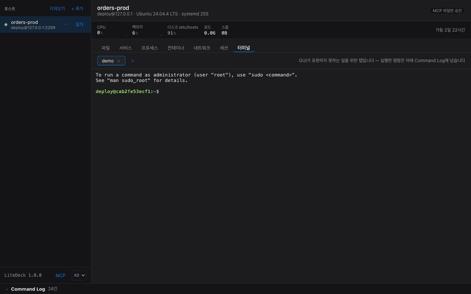
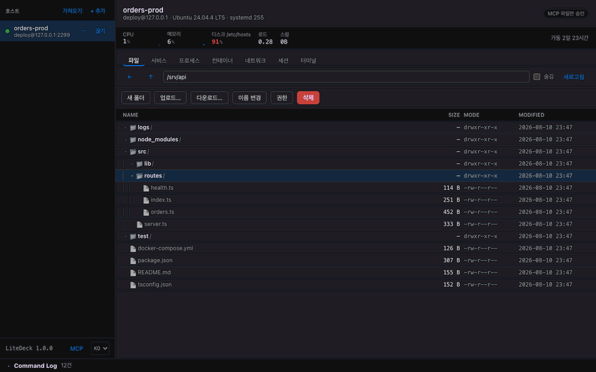

# 기능 자세히

[← README](../README.md)

## Command Log: GUI로 CLI를 배웁니다

<p align="center">
  
</p>

<p align="center"><sub>재시작이 권한 부족으로 거부되자 <b>물어봅니다</b>. 실행된 명령은 그대로 보이고, 비밀번호는 stdin으로 가서 보이지 않습니다.</sub></p>


운영 서버를 만지는 GUI는 결국 "믿어달라"고 요구하는 셈입니다. LiteDeck은 **방금 무엇을 실행했는지 정확히 보여주는 것**으로 그 신뢰를 얻습니다.

```
$ systemctl list-units --type=service --all --output=json               120ms
$ journalctl -u myapp.service -n 200 -f --no-pager -q
$ sudo -S -p '' -- systemctl restart -- myapp.service                   310ms
$ powershell -EncodedCommand ⟨utf8 prelude⟩ Restart-Service -Name 'Spooler' -Force
```

비밀번호는 표준 입력으로 전달되므로 **명령줄을 그대로 보여줘도 안전합니다.** 이 기록은 로컬에만 남고 외부로 나가지 않습니다.

## 편집기: 양쪽 어디에도 설치가 없습니다

<p align="center">
  
</p>

<p align="center"><sub>터미널에 <code>code .</code> 을 치면 <b>그 줄이 서버로 가기 전에</b> 앱이 가로채 파일 탭으로 옵니다. <code>vi</code> 로 새 파일을 열면 편집기 탭이 열립니다. 서버에는 VS Code도 vi도 필요 없습니다.</sub></p>


원격 파일을 고치려면 보통 둘 중 하나를 깝니다. 서버에 `vscode-server`(수백 MB)를 올리거나,
서버의 `vi`·`nano`를 터미널로 쓰거나. LiteDeck은 **둘 다 안 합니다.**

- **서버 쪽.** 아무것도 필요 없습니다. 파일은 SSH가 이미 제공하는 SFTP로 읽고 씁니다.
  서버에 편집기가 없어도, 있어도 상관없습니다
- **클라이언트 쪽.** VS Code를 설치할 필요가 없습니다. 편집기가 앱 안에 들어 있습니다
  (CodeMirror, 문법 24종). 첫 파일을 열 때 로드되므로 디렉터리만 보다 끄면 비용이 없습니다

터미널에서 `code .` 이나 `vi foo.conf` 를 치면 **앱이 그 줄을 서버로 보내기 전에 가로채**
파일 탭으로 이동합니다. 서버는 이 기능의 존재를 모릅니다. 그래서 서버에 VS Code도 vi도
없어도 되고, 반대로 **서버 쪽에서 무언가 열리는 일도 없습니다.**

<p align="center">
  
</p>

<p align="center"><sub>트리에서 파일을 열면 문법 강조가 붙은 편집기가 오른쪽에 열립니다. 저장을 누르면 <b>서버에 지금 들어 있는 내용과의 diff</b> 가 먼저 뜹니다.</sub></p>

확인하고 넘어가면 임시 파일에 쓴 뒤 `rename`으로 갈아끼웁니다. 저장이 중간에 끊겨도
원본이 반토막 나지 않습니다.

> 대비: VS Code Remote-SSH는 서버에 서버를 설치합니다. 저사양 VPS에서 `vscode-server`가
> 메모리를 잡아먹는 것은 잘 알려진 문제입니다. 본격 원격 IDE가 필요하면 그쪽이 정답이고,
> **설정 파일 하나 고치자고 수백 MB를 올리기 싫을 때** 이쪽이 답입니다.

## 트리에서 이름으로 거르기

주소창 옆 칸에 이름 일부를 치면 목록이 좁혀집니다 (`⌘F` · `Ctrl+F`).

**서버에는 아무것도 묻지 않습니다.** 앱이 이미 받아 둔 목록만 거르므로, 아무리 빨리 입력해도
서버가 하는 일은 없습니다. 한 번 열어 본 폴더는 접어 두었어도 검색 대상이라, 접힌 폴더 안에
있는 파일도 경로째 올라옵니다.

대신 **한 번도 열어 보지 않은 폴더는 보지 않습니다.** 원격에서 `find` 를 돌리면 그 폴더까지
찾을 수 있지만, 그건 서버가 값을 치르는 일이고 이 도구가 하지 않기로 한 쪽입니다. 일치가
없을 때 화면이 그렇게 적어 둡니다.

## 전송: 폴더째, 그리고 끊기면 이어받기

디렉터리를 통째로 올리고 내립니다. 큐에는 파일마다가 아니라 **트리 하나당 한 줄**이 생기고,
그 줄이 몇 번째 파일을 옮기는 중인지 보여줍니다.

서버 쪽 비용을 신경 썼습니다. 트리를 훑는 것도 옮기는 것도 **SFTP 뿐**입니다 — `find` 도
`tar` 도 돌리지 않으므로 서버에 프로세스가 뜨지 않습니다. 훑는 단계는 작업 안에서 돌아서
**취소 버튼이 거기까지 닿습니다.** 실수로 큰 디렉터리를 골랐을 때 멈출 방법이 있다는 뜻입니다.

**끊긴 전송은 이어받습니다.** SFTP는 읽기·쓰기마다 절대 오프셋을 실어 보내는 프로토콜이라,
이어붙이는 것 자체는 seek 한 번입니다. 어려운 쪽은 *이어붙일 대상이 정말 같은 파일인가* 이고,
LiteDeck은 이렇게 확인합니다:

- 원본의 **크기와 수정 시각**이 전송을 시작할 때와 같은지
- 이어붙일 지점 **바로 앞 64KB를 양쪽에서 다시 읽어 비교**

두 번째가 필요한 이유는 SFTP가 수정 시각을 **초 단위**로만 전달하기 때문입니다. 같은 1초
안에 같은 길이로 다시 만들어진 파일은 크기와 시각만으로는 구분되지 않습니다. 이음매의 바이트가
다르면 이어받기를 거부하고 받다 만 파일을 지웁니다.

> 이 검사는 이음매를 봅니다. 이미 받은 구간 전체를 검증하려면 원본을 처음부터 다시 읽어야
> 하는데, 그건 이어받기가 피하려던 바로 그 일입니다. 그래서 **길이가 정확히 같고 64KB 창
> 바깥만 달라진 원본**은 통과할 수 있습니다. 한계를 적어두지 않으면 그만큼 더 믿게 되므로
> 적어둡니다.

폴더 전송은 이어받기 대상이 아닙니다. 이미 옮긴 파일을 크기만으로 건너뛰면, 길이가 같고
내용만 바뀐 파일이 옛 사본으로 남습니다.

## Compose: 컨테이너 하나가 아니라 프로젝트를 재시작

Compose로 띄운 컨테이너는 카드에 프로젝트 이름이 붙고, **재시작** 옆의 ▾ 에서 범위를
고를 수 있습니다.

| 범위 | 실행되는 것 |
|---|---|
| 이 컨테이너만 | `docker restart <id>` — 기본값이자 지금까지의 동작 |
| 서비스 전체 | `docker compose --project-name <p> restart -- <service>` |
| 프로젝트 전체 | `docker compose --project-name <p> restart` |

서비스 항목은 그 서비스에 컨테이너가 둘 이상일 때만 나옵니다. 하나뿐이면 "이 컨테이너만"과
같은 일이라, 둘 다 보여주면 무엇이 다른지 알아내는 일만 남습니다. 프로젝트 전체는 다른
서비스도 함께 내렸다 올리므로 대상 목록을 먼저 보여주고 확인을 받습니다 — **그 목록은 이미
화면에 있는 것이라 서버에 아무것도 더 묻지 않습니다.**

**소속은 명령을 하나도 더 쓰지 않고 알아냅니다.** `docker ps` 출력에 이미 Compose가 붙여
둔 라벨이 실려 있습니다. 프로젝트를 알아내려고 파일 시스템을 뒤지거나 `docker inspect` 를
컨테이너마다 부르는 방식이었다면 컨테이너 20개짜리 서버에서 목록 한 번에 왕복 20번이 됐을
겁니다.

**compose 파일은 읽지 않습니다.** 프로젝트를 이름으로만 부르고, Compose가 실행 중인
컨테이너의 라벨에서 나머지를 복원합니다. 그래서 파일이 이 계정이 못 읽는 곳에 있거나 아예
사라졌어도 동작합니다 — 서버에 배포해 두고 소스는 다른 데 있는 흔한 경우가 여기 해당합니다.

`down`·`up`·`run` 은 없습니다. 재시작과 같은 자리에 두기에는 하는 일이 다릅니다.

## sshd 설정 점검

네트워크 탭 아래에 서버의 sshd 설정을 읽어 짚을 것을 적습니다. `PermitRootLogin yes`,
`PermitEmptyPasswords yes`, `MaxSessions` 가 낮은 경우 등입니다.

**`sshd -T` 를 쓰지 않습니다.** 그쪽이 기본값까지 채운 실효 설정을 주지만 root가 필요하고,
읽기만 하는 화면이 비밀번호부터 요구하면 아무도 열지 않습니다. 대신 **이미 열려 있는 SFTP로
설정 파일을 읽습니다** — 어느 배포판에서나 누구나 읽을 수 있게 깔리고, 명령은 하나도 실행하지
않습니다.

그 대가는 이렇습니다. **파일에 적힌 값만 압니다.** 파일이 정하지 않은 항목은 sshd
기본값이 적용되는데, 그 값은 배포판마다 다르므로(데비안의 `PermitRootLogin` 은 상류와 다릅니다)
여기서 추측하지 않습니다.

읽을 때 두 가지를 지킵니다. **`Match` 블록 안의 값은 서버 전체 설정이 아닙니다** — `Match
Address 10.0.0.0/8` 아래의 `PermitRootLogin yes` 를 서버 설정으로 보고하는 것이 이 파일을
오독하는 대표적인 방식입니다. 그리고 **sshd는 먼저 읽은 값을 씁니다** — 대부분의 설정 형식과
반대이고, 배포판이 `Include` 를 파일 맨 위에 두는 이유입니다.

## ProxyJump: 경유 서버 한 단계

호스트 편집기의 ProxyJump 칸에 `jump@bastion:22` 를 적으면 그 서버를 먼저 거쳐 갑니다.

경유 서버도 **로그인하는 서버**이므로 그렇게 다룹니다. **지문을 따로 확인하고 비밀번호도 따로
묻습니다.** 경유 서버의 호스트 키를 검사하지 않는 ProxyJump는 그 포트에 응답하는 누구에게든
세션 전체를 넘기는 것이고, 그건 경유가 막으려던 바로 그 일입니다. 목적지의 호스트 키도 그대로
검사합니다 — 경유 서버는 바이트를 전달할 뿐, 반대편이 누구인지 보증하지 않습니다.

한 단계만 지원합니다. 여러 단계를 적으면 **첫 단계로 줄이지 않고 거부합니다.** 적은 곳이 아닌
데로 접속하는 것이 접속하지 않는 것보다 나쁘기 때문입니다.

경유 서버의 sshd에 `AllowTcpForwarding yes` 가 필요합니다. 꺼져 있으면 sshd가
`administratively prohibited` 로 거절하는데, 그대로 읽으면 계정 권한 문제처럼 보여
엉뚱한 곳을 뒤지게 됩니다. 그래서 **어느 서버의 어떤 설정인지 풀어서 보여줍니다.**
