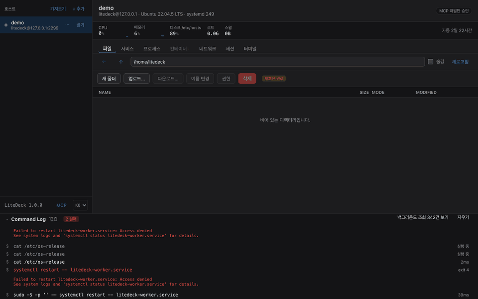

# MCP 연동

[← README](../README.md)

<p align="center">
  
</p>

<p align="center"><sub>MCP 클라이언트가 파일을 고치려 하자 <b>서버의 현재 내용 대비 diff</b> 가 뜹니다. 승인한 것은 되돌릴 수 있습니다.</sub></p>


Claude Code·Claude Desktop 같은 MCP 클라이언트가 이 앱을 통해 서버를 **조회하고 바꿉니다.**
사이드바 아래 **MCP** 버튼에서 켭니다.

> [!IMPORTANT]
> **변경은 기본적으로 매번 물어봅니다.** 승인창에는 실제로 실행될 명령이나 파일 diff가
> 그대로 뜹니다. 그 결재 정책은 **앱이 소유하며 클라이언트 쪽에서는 끌 수 없습니다.**

```
Claude Code  ──MCP(로컬 HTTP)──▶  LiteDeck  ──기존 SSH 연결──▶  서버
```

MCP 클라이언트는 **GUI가 앉던 자리에 앉습니다.** 같은 어댑터, 이미 인증된 같은 SSH 연결,
같은 Command Log를 씁니다. 거기서 나온 명령은 `MCP` 표시로 흐릅니다.
서버 쪽에는 여전히 **아무것도 설치하지 않습니다.** Claude Code를 서버에 깔면
런타임과 상주 프로세스가 생기고, 컨텍스트 수집용 파일 탐색이 저사양 서버의 I/O를
때립니다. 그 부하는 전부 클라이언트가 집니다.

**조회 13개**: `hosts_list` · `health_snapshot` · `sys_stats` · `svc_list` · **`svc_logs`** ·
`proc_list` · `container_list` · **`container_logs`** · `net_ports` · `fs_list` · `fs_read` ·
`sessions_list` · **`kuma_status`**. `health_snapshot` 하나로 CPU·메모리·디스크·failed 유닛·
비정상 컨테이너·외부 노출 포트가 한 번에 오고, `svc_logs` 가 **왜** 죽었는지를 말해줍니다.

**변경 5개**: `svc_control`(시작/중지/재시작) · `container_control` · `proc_signal`(TERM/KILL) ·
`fs_write` · `fs_delete`.

**`kuma_status` — Uptime Kuma 의 모니터.** 「지금 죽어 있는 게 있나」에 답합니다.
`health_snapshot` 과는 다른 질문입니다 — 그쪽은 *이 서버*, 이쪽은 *이 서버가 지켜보는 것들*.
읽는 곳은 Kuma 의 **`/metrics`** (Prometheus 텍스트) 하나뿐입니다. Kuma 자신의 README 가
「API 는 자체 웹 UI 용으로 만들었고 서드파티 연동을 보장하지 않는다」고 적어 두었고,
`/metrics` 만이 바깥에서 읽으라고 있는 표면이라서입니다. `/api/*` 는 건드리지 않습니다.

**쓰기는 없습니다.** 모니터를 만들거나 고치거나 지우는 도구는 넣지 않았습니다 — 그건 Kuma 의
일이고, 보장되지 않는 표면 위에 쓰기를 얹는 것은 되돌릴 수 없는 방향의 실수입니다.
포트와 API 키는 **네트워크 탭의 Kuma 설정**에서 서버별로 지정합니다. 키는 이 컴퓨터의
자격증명 저장소에만 저장되고 (§7.4), Command Log 의 줄에는 자리표시자로 남습니다.

**되돌릴 수 있습니다.** MCP가 파일을 덮어쓰거나 지우기 전에 이전 내용을 **이 컴퓨터에** 보관하고,
MCP 패널의 **바뀐 파일** 탭에서 파일별로 되돌립니다. 안 묻기로 두고 자리를 비웠을 때 방어 대신
남는 것이 이것입니다. **24시간이 지나면 알아서 지워집니다.** 하룻밤을 위한 가드지 보관소가 아닙니다.
서버에는 아무것도 남기지 않고, `fs_delete` 는 사본을 못 남기면(바이너리·초대형) 아예 거부합니다.

**파일 삭제는 서버별로 따로 켭니다.** 읽기 공유·변경 승인과 별개인데, *도구가 존재하는가* 와
*쓸 때 물어보는가* 는 다른 질문이기 때문입니다.

**일부러 안 넣은 것**: 임의 명령 실행, 디렉터리 재귀 삭제, 컨테이너·이미지 삭제입니다.
임의 명령이 있으면 도구별 허용 설정이 장식이 되고, 나머지 셋은 사본을 남길 수 없어
되돌리기가 성립하지 않습니다.

**안전장치**

| | |
|---|---|
| 서버별 opt-in | **기본 전부 꺼짐.** 호스트를 등록해도 MCP는 못 봅니다. 앱에서 켠 것만 읽힙니다. 파일 삭제는 또 따로 켭니다 |
| 변경 결재 | 기본은 **파일 변경만 물어봄**. 승인창이 서버 현재 내용 대비 diff를 보여주는데, 그건 클라이언트가 가질 수 없는 정보이기 때문입니다. 재시작 등은 클라이언트가 이미 같은 걸 보여줬으므로 그냥 실행합니다 |
| 호스트별 조절 | 헤더의 배지에서 **전부 물어보기 / 파일만 / 밤새 안 묻기**. 통과 모드는 배지가 붉게 남고 **시간이 지나면 스스로 돌아옵니다** |
| 원격에서 못 바꿈 | 그 스위치를 켜는 도구도, 완화하는 파라미터도 없습니다. **모델이 자기 승인을 요청할 방법이 없습니다** |
| 읽기 ≠ 쓰기 | 읽으라고 공유해도 바꿀 수 있게 되지는 않습니다 |
| 바인딩 | `127.0.0.1` 전용. 외부 인터페이스로 여는 설정이 없습니다 |
| 인증 | Bearer 토큰. 설정에 저장되고, 재발급 버튼으로만 바뀝니다 |
| 레이트 리밋 | 초당 1.5회, 순간 8회. 에이전트 루프가 서버를 때리지 못하게 |
| 감사 | 모든 도구 호출이 Command Log에 남습니다. 로컬에만, 어디로도 안 갑니다 |

## 연결하기

MCP 패널의 **연결** 탭에서 클라이언트를 고르고 **복사** 를 누르면 됩니다. 붙여넣을 줄을 앱이 조립하므로 포트·토큰을 손으로 옮길 일이 없습니다.

| 클라이언트 | 상태 | 붙이는 법 |
|---|---|---|
| **Claude Code** | ✅ **실기 검증** | `claude mcp add --transport http …` 한 줄 |
| **Claude Desktop** | ⬜ 미검증 | 같은 Streamable HTTP 설정 |
| **Codex CLI** | ✅ **기여자 검증** | 토큰을 환경변수 **이름**으로 받습니다 (아래) |
| 그 밖의 MCP 클라이언트 | ⬜ 미검증 | Streamable HTTP + Bearer를 지원하면 됩니다 |

```bash
# Claude Code
claude mcp add --transport http litedeck http://127.0.0.1:<포트>/mcp \
  --header "Authorization: Bearer <토큰>"

# Codex CLI — 토큰 값이 아니라 환경변수 이름을 넘깁니다
export LITEDECK_MCP_TOKEN=<토큰>
codex mcp add litedeck --url http://127.0.0.1:<포트>/mcp \
  --bearer-token-env-var LITEDECK_MCP_TOKEN
```

> [!NOTE]
> **검증 상태를 구분해서 적습니다.**
>
> **Claude Code 2.1.22 — 저자 PC에서 검증됨.** 엔드포인트에 붙는 것(`✓ Connected`),
> 프로토콜 전 구간(initialize·tools/list·tools/call·거부·인증·레이트 리밋), 그리고
> 실제 Ubuntu 24.04.4 서버를 상대로 모델이 스스로 도구를 호출해 조회하고 파일을
> 읽고 쓰는 것까지 왕복했습니다.
>
> **Codex CLI — 기여자가 붙여서 확인했습니다.** 저자 환경에는 Codex가 없어
> 오랫동안 미검증으로 두었던 항목입니다. [@INMD1](https://github.com/INMD1) 님이
> 실제로 연결해 동작하는 것을 확인해 주셨습니다.
>
> 저자가 직접 확인한 것은 여전히 프로토콜 쪽뿐입니다 — Codex가 하는 요청을 흉내 내
> 보면 엔드포인트가 전부 올바르게 답합니다: OAuth 탐색에 404(= OAuth 없음, Bearer로
> 폴백), 무인증에 `401 WWW-Authenticate: Bearer`, SSE를 여는 `GET` 에 명세가 지정한
> 405, `Accept` 헤더가 없어도 200.
